# Carefully Crafted Plugins v6 Supervision Redesign Implementation Plan

> **Final canonical plan.** This is the sole active implementation plan for the v6 redesign. The Superpowers research, Codex-advisor analysis, product decisions, and execution tasks are consolidated here; do not create a companion plan or addendum.
>
> **For agentic workers:** REQUIRED SUB-SKILL: Use `superpowers:subagent-driven-development` (recommended) or `superpowers:executing-plans` to implement this plan task-by-task. Steps use checkbox (`- [ ]`) syntax for tracking. This instruction governs implementation of the plugin release; the shipped `/contexthub:supervise` runtime must not invoke either execution skill because Claude is the sole runtime orchestrator.

**Goal:** Reduce Carefully Crafted Plugins to ten high-value skills and add a token-efficient `/contexthub:supervise` workflow in which Claude plans and supervises while isolated GPT-5.6 Sol Codex workers implement and verify the work.

**Architecture:** Superpowers owns software-development methodology; Carefully Crafted owns only cross-provider deliberation, deterministic Codex transport, task isolation, receipts, integration, and bounded supervision. A short manual-only `supervise` skill drives a zero-dependency Node state machine whose durable ledger lives in Git metadata and whose workers run in isolated worktrees. Claude receives only compact grader, checkpoint, and final artifacts while full worker output remains on disk.

**Tech Stack:** Claude Code plugin/skill format, Claude Code plugin dependencies, Node.js 20+ standard library only, `node:test`, Git worktrees, Codex CLI `exec --json`, GPT-5.6 Sol.

**Research basis:**

- [Claude Code plugin dependencies](https://code.claude.com/docs/en/plugin-dependencies)
- [Claude Code plugin manifest reference](https://code.claude.com/docs/en/plugins-reference)
- [Claude Code skills and `disable-model-invocation`](https://code.claude.com/docs/en/slash-commands)
- [Codex non-interactive mode](https://developers.openai.com/codex/noninteractive)
- [GPT-5.6 Sol model contract](https://developers.openai.com/api/docs/models/gpt-5.6-sol)
- [Codex workspace-write Git metadata constraint](https://github.com/openai/codex/issues/15505) and [tracked writable-gitdir design](https://github.com/openai/codex/issues/14338)
- [Superpowers workflow and per-harness installation](https://github.com/obra/superpowers)

## Verified capability baseline

Probed directly against the installed toolchain on 2026-07-18. Tasks 7–10 build against
these **verified** facts, not documentation inference. Re-run this probe set before
implementation begins and fail Task 1 if any line no longer holds.

| Fact | Verified value |
|---|---|
| Codex CLI | `codex-cli 0.144.5` (matches the intended fixture baseline) |
| Claude Code | `2.1.199` (clears the `2.1.143` dependency-enforcement floor) |
| `exec` flags | `-C/--cd`, `-s/--sandbox`, `--json`, `--output-schema`, `-o/--output-last-message`, `-m/--model`, `-c/--config`, `--skip-git-repo-check`, `--add-dir`, `--ephemeral` |
| `exec` sandbox values | exactly `read-only`, `workspace-write`, `danger-full-access` |
| `exec resume` flags | `--json`, `--output-schema`, `-o/--output-last-message`, `-m/--model`, `-c/--config`, `--last`, `--all` |
| **`exec resume` omissions** | **no `-s/--sandbox` and no `-C/--cd`** — confirms the same-worktree process-`cwd` resume design in Task 8 Step 6 |
| JSONL events (authoritative) | `{"type":"thread.started","thread_id":"…"}` and `{"type":"turn.completed","usage":{"input_tokens","cached_input_tokens","output_tokens","reasoning_output_tokens"}}` — exact field names confirmed |
| Additional JSONL events | `turn.started` and `item.completed` also appear; the parser must ignore unknown event types rather than fail |
| `plugin list --json` | returns `installed[]` entries with `pluginId`, `name`, `version`, `installed`, `enabled`, `source.source`, `source.path` |
| Codex-side Superpowers | `superpowers@openai-curated` present, installed, enabled, local `source.path`; all four required worker skills (`test-driven-development`, `systematic-debugging`, `verification-before-completion`, `receiving-code-review`) exist |
| Model | `gpt-5.6-sol` confirmed real and valid; `xhigh` confirmed a valid effort |
| Structured output | `--output-schema <file> -o <file>` writes schema-conforming JSON to the last-message file |

**Three refuted or unstated behaviours that change the implementation:**

1. **`-c model_reasoning_effort=ultra` is silently accepted and runs to completion.** `-c` is
   an unvalidated raw TOML override; the CLI performs no effort-value validation. Effort
   rejection is therefore **entirely a wrapper-side pre-spawn responsibility**. The fake Codex
   must *not* model CLI-side rejection, or the rejection tests prove nothing about production.
2. **Codex blocks on `Reading additional input from stdin…` even when a prompt argument is
   supplied,** unless stdin is explicitly closed. Every spawn must set `stdio` stdin to
   `'ignore'` (or `/dev/null`). This is a live hang risk in an unattended harness.
3. **Healthy runs may emit unrelated stderr noise** (observed: a models-cache warning). The
   "malformed line fails the run" rule applies to **stdout JSONL only**; stderr is captured as
   diagnostics and never fails a run by itself.

Also noted: `codex exec review` exists as a native subcommand. Task 5 deliberately does not use
it, because it provides no schema control and no provenance guarantee over returned findings;
record this as a considered rejection rather than an oversight.

**Still unverified (requires a paid workspace-write call):** whether a resumed session preserves
`workspace-write` confinement, since `resume` cannot set `--sandbox`. Task 8 Step 6 already
carries the correct fallback — preflight disables resume and forces `session_policy: "fresh"`.

## Global Constraints

- Ship exactly ten skills: `codex/{exec,imagegen,reason,resume,review,setup}`, `agy/{exec,nanobanana}`, and `contexthub/{converge,supervise}`.
- Delete `/codex:playwright`, `/agy:longctx`, `/agy:veo`, `/agy:setup`, and `/contexthub:{spec,plan,tdd,review,verify,debug,ship,triage}` with no aliases.
- Treat Superpowers as the required methodology. Do not copy its skill bodies, use `@` includes, or recreate planning, TDD, debugging, review, verification, worktree, or branch-finishing workflows.
- Reference Superpowers skills by namespaced name in Claude and by installed skill name in Codex work orders.
- Do not invoke Claude-side `superpowers:subagent-driven-development`, `superpowers:executing-plans`, or `superpowers:dispatching-parallel-agents` from `/contexthub:supervise`.
- Do not permit nested worker fan-out. Claude owns the complete runtime task graph and the two-wave bound.
- Use the active Claude model. Do not force a Claude model, effort, or forked context in skill frontmatter.
- Use `gpt-5.6-sol` explicitly for every supervisor-owned Codex call.
- Use grader effort `medium`; use worker effort only from `high`, `xhigh`, and narrowly-scoped `max`.
- Reject `ultra`: current GPT-5.6 Sol supports `none|low|medium|high|xhigh|max`; Ultra is not a single-worker reasoning effort. **The CLI does not enforce this** — `-c model_reasoning_effort=ultra` is silently accepted and billed (verified). Every effort value must be validated against an allowlist in the wrapper *before* the argv is built; no unvalidated caller string may ever reach `-c model_reasoning_effort=`.
- Use `read-only` for grading and `workspace-write` for isolated implementation worktrees. Never use `danger-full-access` in supervision.
- Run at most three Codex workers concurrently and at most two implementation waves.
- Never install CLIs, plugins, packages, extensions, or dependencies during skill execution.
- Introduce no npm dependency and no package manager step. Use Node 20+ built-ins and existing `git`, `codex`, and `agy` executables only.
- Keep every explicit workflow manual-only with `disable-model-invocation: true`. This defers the skill's large body cost (350 tok–2k per skill) until the user invokes it, and prevents unwanted automatic invocation. **Corrected 2026-07-20:** it does *not* eliminate the always-on cost. Task 13 Step 5 measured every manual-only skill at ~60–100 tok always-on, statistically indistinguishable from the two model-invocable ones. The original claim of "zero Claude context cost" was an unverified assumption, measured only after the surface had been built on it; see the measured table in Step 5.
- Keep `supervise/SKILL.md` under 100 body lines. Put deterministic rules in scripts and detailed recovery guidance in one directly-linked reference file.
- Do not push, merge, open a PR, deploy, delete uncertain worktrees, or perform irreversible actions without fresh user consent.
- Preserve historical v5 documents as history; add a superseded notice instead of rewriting their recorded design.

---

## Locked product decisions

### 1. Superpowers and Carefully Crafted are complementary

| Owner | Responsibilities |
|---|---|
| Superpowers | brainstorming, design approval, detailed plan structure, TDD, systematic debugging, verification discipline, review response, branch-finishing choices |
| Carefully Crafted | complexity grading, external-worker invocation, task graph validation, worktree isolation, compact receipts, deterministic integration, bounded second pass, cross-provider convergence |

The quality bar must reject any future Carefully Crafted skill whose primary purpose duplicates a Superpowers methodology skill. `supervise` is an alternate external execution engine after Superpowers planning, not a second development methodology.

The private worktree allocator and verification runner are enforcement primitives, not replacement methodology: they expose no public worktree/verification skill, make no planning or completion judgment, and only enforce isolation plus execute the exact plan-approved checks. `superpowers:using-git-worktrees` remains the normal human-facing Superpowers workflow outside `/supervise`; inside `/supervise`, deterministic ledger-owned worktrees are necessary so concurrent external processes cannot share a checkout. Likewise Superpowers decides when evidence is sufficient, while the host runner merely produces authenticated evidence.

### 2. Superpowers dependency contract

Add the cross-marketplace trust declaration to `.claude-plugin/marketplace.json`:

```json
"allowCrossMarketplaceDependenciesOn": [
  "claude-plugins-official"
]
```

Add this sole dependency to `plugins/contexthub/.claude-plugin/plugin.json`:

```json
"dependencies": [
  {
    "name": "superpowers",
    "marketplace": "claude-plugins-official"
  }
]
```

Use no Superpowers version constraint. Claude Code resolves constrained Git dependencies from `{plugin-name}--v{version}` tags; the official Superpowers marketplace entry is currently SHA-pinned and does not establish that tag contract. Release validation records the tested upstream version instead. Document Claude Code `2.1.143` as the minimum version for dependency enforcement, probe `claude --version` in the release smoke test, and report an actionable error when the official marketplace is unavailable or blocked by organization policy.

Claude-side dependency resolution cannot install Superpowers inside Codex. `supervise` must parse `codex plugin list --json`, require an installed and enabled `superpowers@openai-curated`, and stop before mutation with this action when absent:

```text
Install and enable the Codex worker methodology first:
codex plugin add superpowers@openai-curated
Then rerun /contexthub:supervise.
```

Antigravity-side Superpowers is not required in v6 because Antigravity supplies opinions through `converge` and general delegation through `agy:exec`; it is not an implementation backend for `supervise`.

### 3. Private Codex transport, public Codex skills

`/contexthub:supervise` must call the underlying `codex exec` CLI through its own private structured module. It must not invoke the public `/codex:exec` skill: loading that skill and relaying raw stdout would spend Claude tokens and make orchestration nondeterministic. It also must not import `../codex/scripts/codex-invoke.mjs`; separately cached Claude plugins have no stable sibling filesystem relationship.

Do not declare a same-marketplace dependency on the public `codex` plugin. The supervisor uses the Codex CLI directly and `converge` also delegates through CLIs, so auto-installing the bridge would be an unnecessary dependency. Users may install the retained public Codex bridge independently when they want `/codex:*` commands.

### 4. Supervisor state machine

```mermaid
stateDiagram-v2
    [*] --> INITIALIZED
    INITIALIZED --> GRADING
    GRADING --> GRADED
    GRADED --> APPROVAL_PENDING: plan has gated actions
    GRADED --> PLANNED: Claude reviews grade and accepts plan
    APPROVAL_PENDING --> PLANNED: user records approvals
    APPROVAL_PENDING --> GRADED: user rejects; revise plan
    PLANNED --> WAVE_1_RUNNING
    WAVE_1_RUNNING --> WAVE_1_COMPLETE
    WAVE_1_COMPLETE --> REVIEWED: Claude second-pass review
    REVIEWED --> WAVE_2_RUNNING: gaps exist
    REVIEWED --> VERIFYING: no gaps
    WAVE_2_RUNNING --> WAVE_2_COMPLETE
    WAVE_2_COMPLETE --> CORRECTIONS_REVIEWED: Claude final acceptance review
    CORRECTIONS_REVIEWED --> VERIFYING: all criteria satisfied
    CORRECTIONS_REVIEWED --> BLOCKED: unresolved gap; no third wave
    VERIFYING --> FINISH_PENDING: all acceptance criteria pass
    VERIFYING --> BLOCKED: evidence fails
    FINISH_PENDING --> FINISH_ACTION_PENDING: exact user choice recorded
    FINISH_ACTION_PENDING --> COMPLETE: keep/action evidence or discard cleanup verified
    INITIALIZED --> BLOCKED
    GRADING --> BLOCKED
    GRADED --> BLOCKED
    APPROVAL_PENDING --> BLOCKED
    PLANNED --> BLOCKED
    WAVE_1_RUNNING --> BLOCKED
    WAVE_1_COMPLETE --> BLOCKED
    REVIEWED --> BLOCKED
    WAVE_2_RUNNING --> BLOCKED
    WAVE_2_COMPLETE --> BLOCKED
    CORRECTIONS_REVIEWED --> BLOCKED
    FINISH_ACTION_PENDING --> BLOCKED
```



`BLOCKED` is durable and recoverable only through an explicit event that names the prior phase and points to a newly written changed-condition artifact. Interrupted running phases are also recovered explicitly: the host reconciles process state, receipts, worktrees, and integration HEAD before returning to a stable prior/next phase. `COMPLETE` is terminal. A third execution wave is not representable.

The diagram omits recovery fan-out for readability. `recover` may leave `BLOCKED` only for the recorded prior phase and only after the changed-condition/reconciliation contract passes; it cannot choose an arbitrary phase or skip a review/verification gate.

### 5. Complexity and effort policy

| Score | Meaning | Max concurrency | Default worker effort |
|---:|---|---:|---|
| 1 | localized mechanical change with an obvious check | 1 | `high` |
| 2 | a few known files with low coupling | 2 | `high` |
| 3 | multiple components or moderate ambiguity | 2 | `high`; `xhigh` for the risky task |
| 4 | cross-cutting behavior, public contract, difficult validation | 3 | `xhigh` |
| 5 | architecture-wide, security/migration risk, major unknowns | 3 | `xhigh`; one `max` critical bottleneck at a time |

The grader score is advisory. Claude records `grader_score`, `claude_score`, and a non-empty `override_reason` whenever it changes the score. The task graph validator rejects `max` below Claude score 5 and rejects every worker effort outside `high|xhigh|max`.

### 6. Token-efficiency budget

- Save the original request once as `request.md`; workers receive its path, never repeated prose.
- Let the grader inspect the repository directly and return at most 12 relevant paths plus compact verification hints.
- Cap grader and model worker reports at 4 KiB each.
- Cap normal CLI stdout at 1 KiB and every compact Claude-facing checkpoint/final receipt at 8 KiB.
- Keep Codex JSONL, stderr, command traces, diffs, and long reports under the run ledger; never stream them into Claude.
- Make the host authoritative for thread ID, usage, commit, changed files, exit status, and ownership. Never trust the model to self-report host facts.
- Keep Git metadata read-only to Codex workers under `workspace-write`. Workers edit files and report; only the host stages the verified owned diff and creates the single task commit.
- After wave one, Claude reads the compact checkpoint first and opens a diff/report only for `GAP`, `UNCERTAIN`, conflict, concern, or designated high-risk files.
- Resume an exact worker thread only for a task-local correction at the same effort and in the same isolated worktree. Start a fresh thread for cross-task corrections or effort escalation. Never use `resume --last` inside supervision. Do not automatically retry a writing worker after a timeout or transport ambiguity; inspect its worktree and exact thread, then block or explicitly resume.

### 7. Approval boundary

Invoking `/contexthub:supervise` authorizes ordinary local reads, isolated worktree edits, tests, local task commits, and integration commits within the original request. Pause before dispatch when the plan introduces any of these:

- destructive or irreversible work;
- a new package, plugin, dependency, or network requirement;
- credentials or privileged access;
- database or persisted-data migration;
- an unresolved security/authentication or public API decision;
- material scope expansion;
- push, merge, PR creation, deploy, or publication;
- a genuine product decision the original request does not resolve.

The machine task graph stores typed approval flags with stable IDs, categories, decision state, exact prompt, evidence, and timestamps. `accept-plan` must return `APPROVAL_PENDING` until each flag is recorded; approval decisions are idempotent and a rejection returns the run to planning or blocks it. Prose approval in a worker prompt is not sufficient.

### 8. Converge boundary

Keep `/contexthub:converge` as a manual, read-only, non-recursive source of independent views. It may produce decision evidence for Superpowers brainstorming or challenge competing hypotheses after Superpowers systematic debugging has collected evidence. It never writes a spec or plan, implements code, verifies a branch, or launches `supervise`; `supervise` does not automatically launch it.

Prefer the two-external-call lightweight mode for ordinary multiple-view requests. Require the explicit `--full` intent for the six-call critique/refinement protocol so the user chooses the larger cost.

### 9. Independent-review evidence contract

Retain two ideas from the Codex-advisor pattern, but only inside the manual `/codex:review` transport: gather repository context lazily, and preserve every returned claim before Claude evaluates it. Do not add a Codex MCP dependency, an advisor skill, or another supervision phase.

An explicit review resolves its scope in this order: the user's arguments/file references/revision range, otherwise the staged, unstaged, and named untracked working-tree changes, otherwise one concise request for a target. It states the chosen scope before invoking Codex. Pass the repository cwd, target paths or revisions, and paths to relevant rules such as `AGENTS.md`, `CLAUDE.md`, or project constraint files; do not inline whole files, diffs, rule files, or a generic menu of shell commands. Codex inspects only what it needs under `read-only`.

The review result is structured and provenance-preserving. The exact Codex response remains unchanged on disk. Every returned finding has a stable ID and appears exactly once in a bounded index; Claude's evaluation is a separate annotation, never a rewrite or silent filter. Annotate on two independent axes:

```text
Evidence: verified | plausible-unverified | contradicted | context-missing
Kind:     defect-risk | tradeoff | convention-only | scope-not-established
```

These are advisory descriptions, not decisions to accept or reject a finding. Give one short reason grounded in code, tests, requirements, or the specific missing fact. Display one compact row per finding, expand only high-impact, disputed, and context-missing items, and always point to the exact full-result artifact. A valid empty result means only "no actionable findings for this declared scope"; it is not evidence that the code is correct, secure, or ready to ship. Invalid, truncated, or malformed output is an explicit review failure, never an empty review.

When action is requested, hand the annotated finding IDs to `superpowers:receiving-code-review`, which owns verification, pushback, and implementation discipline. `/codex:review` remains read-only. Ask the user only for genuine product, architecture, scope, or approval decisions; do not force a four-option multi-select or an approval round-trip for every finding.

The supervisor needs no new advisor layer. Its authenticated receipts, acceptance matrix, mandatory surfacing of `DONE_WITH_CONCERNS`, and correction workers using `receiving-code-review` already implement the transferable evidence principle without another Claude pass.

---

## Acceptance criteria

- **AC-01:** The repository exposes exactly the ten retained skills and no removed skill directory or active command claim.
- **AC-02:** Installing `contexthub` declares only the cross-marketplace unversioned `superpowers` dependency through valid Claude manifests; the public Codex bridge remains optional.
- **AC-03:** Every explicit workflow uses native `disable-model-invocation: true`; only `codex:imagegen` and `codex:reason` remain model-invocable, while `codex:review` is a manual, path-first independent audit that preserves every returned finding and does not own review methodology.
- **AC-04:** Agy has no Gemini CLI extension, MCP build, API-key wiring, npm install, or `/agy:setup` path.
- **AC-05:** Ordinary Codex skills never auto-scaffold the target repository; `/codex:setup` is explicit and copies packaged defaults without overwriting.
- **AC-06:** The public Codex bridge defaults to `gpt-5.6-sol`, accepts the official effort set, and supports explicit session-ID resume while retaining manual `resume --last` only for `/codex:resume`.
- **AC-07:** Supervisor grading is exactly GPT-5.6 Sol, medium effort, low verbosity, and read-only.
- **AC-08:** Supervisor workers are GPT-5.6 Sol, `high|xhigh|max`, low verbosity, workspace-write, isolated, and never `ultra` or danger-full-access.
- **AC-09:** The durable state reducer enforces one wave-one run, one Claude review, zero or one correction wave, a post-correction Claude acceptance review, fresh final verification, explicit recovery, a recorded two-phase finish/cleanup choice, and terminal completion or evidence-backed blockage.
- **AC-10:** Parallel writers have disjoint ownership and distinct worktrees; wave integration is atomic and deterministic.
- **AC-11:** Host evidence validates worker changes, verification, and host-created task commits; model claims cannot substitute for Git or Codex event data.
- **AC-12:** Claude-facing outputs honor byte caps; full worker stdout/JSONL and exact Codex review results remain on disk, while bounded review indexes account for every returned finding exactly once.
- **AC-13:** Superpowers remains the methodology owner and no retained Carefully Crafted skill duplicates its lifecycle skills.
- **AC-14:** `converge` remains explicit, read-only, optional, and complementary; its default is the lightweight independent-view flow.
- **AC-15:** Unit tests, skill lint, eval validation, strict Claude plugin validation, stale-reference audit, and clean-install dependency smoke test pass.

---

## File structure

### Create

```text
docs/superpowers/plans/2026-07-18-carefully-crafted-supervision-redesign.md

plugins/codex/reference/defaults/constraints/code-style.md
plugins/codex/reference/defaults/constraints/design-system.md
plugins/codex/reference/defaults/constraints/security.md
plugins/codex/reference/defaults/output-formats/code-review.md
plugins/codex/reference/defaults/output-formats/image-hero-1024x768.md
plugins/codex/reference/defaults/output-formats/image-icon-256.md
plugins/codex/reference/defaults/output-formats/raw-code.md
plugins/codex/reference/defaults/output-formats/raw-prose.md
plugins/codex/reference/schemas/code-review.schema.json

plugins/contexthub/schemas/complexity.schema.json
plugins/contexthub/schemas/worker-report.schema.json
plugins/contexthub/scripts/supervise.mjs
plugins/contexthub/scripts/supervise/state.mjs
plugins/contexthub/scripts/supervise/contracts.mjs
plugins/contexthub/scripts/supervise/codex.mjs
plugins/contexthub/scripts/supervise/git.mjs
plugins/contexthub/scripts/supervise/scheduler.mjs
plugins/contexthub/scripts/supervise/checkpoint.mjs
plugins/contexthub/scripts/supervise/verify.mjs
plugins/contexthub/skills/supervise/SKILL.md
plugins/contexthub/skills/supervise/references/protocol.md

tests/unit/plugin-surface.test.mjs
tests/unit/supervise-verify.test.mjs
tests/integration/supervise-forward.test.mjs
tests/evals/supervise-boundary-cases.json
tests/unit/supervise-live-evals.test.mjs
tools/run-supervise-live-evals.mjs
tests/unit/plugin-dependencies.test.mjs
tests/unit/stale-references.test.mjs
tests/unit/supervise-state.test.mjs
tests/unit/supervise-contracts.test.mjs
tests/unit/supervise-codex.test.mjs
tests/unit/supervise-git.test.mjs
tests/unit/supervise-scheduler.test.mjs
tests/unit/supervise-checkpoint.test.mjs
tests/unit/supervise-cli.test.mjs
```

`supervise` is manual-only, so it does not need an auto-trigger `evals/evals.json`; executable forward scenarios belong in unit tests with fake Codex binaries and real temporary Git repositories.

### Delete

```text
plugins/codex/hooks/hooks.json
plugins/codex/skills/playwright/
plugins/codex/skills/review/evals/evals.json

plugins/agy/scripts/nanobanana-detect.mjs
plugins/agy/scripts/nanobanana-setup.mjs
plugins/agy/skills/longctx/
plugins/agy/skills/setup/
plugins/agy/skills/veo/
plugins/agy/skills/nanobanana/references/capabilities.md
plugins/agy/skills/nanobanana/references/setup.md

plugins/contexthub/scripts/phase-write.mjs
plugins/contexthub/scripts/triage-write.mjs
plugins/contexthub/skills/spec/
plugins/contexthub/skills/plan/
plugins/contexthub/skills/tdd/
plugins/contexthub/skills/review/
plugins/contexthub/skills/verify/
plugins/contexthub/skills/debug/
plugins/contexthub/skills/ship/
plugins/contexthub/skills/triage/

tests/unit/nanobanana-detect.test.mjs
tests/unit/nanobanana-setup.test.mjs
tests/unit/phase-write.test.mjs
tests/unit/triage-write.test.mjs
```

### Modify

```text
.claude-plugin/marketplace.json
.gitignore
README.md
index.html
quality-bar.md

plugins/codex/.claude-plugin/plugin.json
plugins/codex/scripts/codex-invoke.mjs
plugins/codex/scripts/result-handler.mjs
plugins/codex/scripts/setup.mjs
plugins/codex/reference/critical-evaluation.md
plugins/codex/skills/{exec,imagegen,reason,resume,review,setup}/SKILL.md

plugins/agy/.claude-plugin/plugin.json
plugins/agy/scripts/agy-invoke.mjs
plugins/agy/skills/{exec,nanobanana}/SKILL.md

plugins/contexthub/.claude-plugin/plugin.json
plugins/contexthub/scripts/agent-availability.mjs
plugins/contexthub/skills/converge/SKILL.md
plugins/contexthub/skills/converge/references/critique-and-refinement-prompts.md

tests/unit/agent-availability.test.mjs
tests/unit/agy-collect.test.mjs
tests/unit/agy-invoke.test.mjs
tests/unit/codex-invoke.test.mjs
tests/unit/result-handler.test.mjs
tests/unit/lint-skill.test.mjs
tests/unit/setup.test.mjs
tools/eval-check.mjs
tools/lint-skill.mjs

docs/superpowers/plans/2026-05-28-contexthub-consolidation.md
docs/superpowers/specs/2026-05-28-contexthub-consolidation-design.md
docs/carefully-crafted-plugins/forge/spec/2026-05-28-195003-contexthub-multiagent-consolidation.md
```

---

## Implementation task graph

```text
Task 0 ──→ Task 1 ──→ Task 2 ──┬──→ Task 3
                               ├──→ Task 4 ──→ Task 5
                               └──→ Task 6

Task 6 ──→ Task 7 ──┬──→ Task 8
                    └──→ Task 9

Tasks 7, 8, 9 ──→ Task 10
Tasks 3, 5, 10 ──→ Task 11 ──→ Task 12 ──→ Task 13
```

Task 0 makes this governing document available inside all later worktrees. Tasks 3, 4, and 6 are independently reviewable after Task 2. Tasks 8 and 9 can proceed in parallel after the state/contracts API in Task 7 is accepted. Task 11 waits for both bridge-pruning branches plus supervision, so Task 12 cannot publish the coordinated v6 surface until Agy, Codex, and Contexthub behavior all converge.

### Release coupling and rollback

This plan currently ships as one atomic v6: Task 12 bumps all three plugins together, so the
surface prune (Tasks 2–6) cannot be released unless supervision (Tasks 7–10) clears its Task 13
gates. If the paid smoke test or the clean-install smoke test fails, twelve skills are already
deleted and `6.0.0` is already published with no supported path back.

**Rollback contract.** Tasks 2–6 and Tasks 7–10 land on separate branches and are never squashed
together. If Task 13 exposes an unrecoverable supervision defect:

1. do not publish; the branch stops at Task 12's commit, which is not tagged until Step 9 passes;
2. the supervision commits (Tasks 7–10) are reverted as a unit, leaving the prune intact;
3. `contexthub` ships with `converge` only, `supervise` is withheld, the ten-skill inventory
   contract in `plugin-surface.test.mjs` drops to nine, and AC-07 through AC-12 are deferred;
4. record the defect and the deferred ACs in the release notes rather than weakening a gate.

**Decision locked 2026-07-19: atomic v6.** Splitting into a `6.0.0` prune and a `6.1.0`
supervision release was considered and rejected: it would ship `6.0.0` as a removal-only release
that deletes twelve skills and adds no capability, when `supervise` is precisely what justifies
the prune. The rollback contract above is the accepted mitigation for a Task 13 failure. Task 12's
version table stands as written and the inventory contract targets ten skills.

---

## Task 0: Commit the governing plan before creating worktrees

**Files:**

- Create: `docs/superpowers/plans/2026-07-18-carefully-crafted-supervision-redesign.md`

**Interfaces:**

- Produces: one tracked, immutable planning baseline that workers and integration worktrees can read

- [ ] **Step 1: Review the document path and scope**

Run:

```bash
git status --short docs/superpowers/plans/2026-07-18-carefully-crafted-supervision-redesign.md
```

Expected: exactly this new plan is untracked or staged.

- [ ] **Step 2: Commit only the plan**

```bash
git add docs/superpowers/plans/2026-07-18-carefully-crafted-supervision-redesign.md
git diff --cached --check -- docs/superpowers/plans/2026-07-18-carefully-crafted-supervision-redesign.md
git diff --cached --name-only
git commit -m "docs: plan focused supervision redesign"
```

Expected before commit: the whitespace check exits 0 and the staged-name output contains only this plan. Do not begin Task 1 or create a Superpowers worktree until this commit succeeds; otherwise later worktrees cannot see their governing instructions.

---

## Task 1: Establish a deterministic green baseline

**Files:**

- Modify: `tests/unit/codex-invoke.test.mjs`
- Modify: `tests/unit/agent-availability.test.mjs`
- Modify: `tests/unit/nanobanana-setup.test.mjs`

**Interfaces:**

- Consumes: current product behavior at commit `58fdd80`
- Produces: environment-isolated test helpers; a reliable full-suite baseline

- [ ] **Step 1: Record the baseline, which is expected to be green**

Run:

```bash
node --test tests/unit/*.test.mjs
```

**Expected: 90 tests, 0 failures.** Measured green at commit `58fdd80` on 2026-07-18.

Do **not** treat a green run as a blocker or a reason to deviate. The three problems this task
fixes are **latent and load-dependent**, not reproducible on demand:

- Codex tests inherit an ambient `CODEX_SANDBOX` when one is set in the host environment
  (absent on the audited machine, so those tests pass here);
- healthy fake-agent probes can exceed the 1.5 s bound under parallel load;
- the Nano Banana dry-run test can misclassify its shell-script fake as a missing CLI.

Verified flakiness: the suite failed `nanobanana-setup.test.mjs` when run concurrently with other
processes, then passed three consecutive times when run alone. Record whichever result you observe
and **apply all three hardening fixes in Steps 2–3 regardless of whether you reproduced a failure.**
The goal of this task is a baseline that stays green under the parallel load Tasks 7–13 will
generate, not a red-to-green demonstration.

- [ ] **Step 2: Make the Codex test helper control its sandbox environment**

In `tests/unit/codex-invoke.test.mjs`, change the `run` helper to delete the ambient value unless a test supplies one explicitly:

```js
function run(args, { fakeCodex, recordFile, dir, extraEnv = {} }) {
  const env = {
    ...process.env,
    CODEX_BIN: fakeCodex,
    FAKE_CODEX_RECORD: recordFile,
    ...extraEnv,
  };
  if (!("CODEX_SANDBOX" in extraEnv)) delete env.CODEX_SANDBOX;
  return spawnSync(process.execPath, [SCRIPT, ...args], {
    cwd: dir,
    encoding: "utf8",
    env,
  });
}
```

- [ ] **Step 3: Make healthy fake executables tolerant of parallel test load**

In `tests/unit/agent-availability.test.mjs`, pass `timeoutMs: 5000` to tests expecting a healthy fake executable. Keep the explicit hanging-agent test at `timeoutMs: 300` so timeout behavior remains covered.

In `tests/unit/nanobanana-setup.test.mjs`, make the dry-run's fake `gemini` a direct symlink to `true` instead of spawning another shell script:

```js
const bins = tmp("nbset-bin-");
const trueBin = fs.existsSync("/usr/bin/true") ? "/usr/bin/true" : "/bin/true";
fs.symlinkSync(trueBin, path.join(bins, "gemini"));
```

This test is deleted with the backend in Task 3, but Task 1 must not leave the baseline red in the meantime.

- [ ] **Step 4: Verify the unchanged product is green**

Run:

```bash
node --test tests/unit/*.test.mjs
```

Expected: all current tests pass with zero failures.

- [ ] **Step 5: Commit**

```bash
git add tests/unit/codex-invoke.test.mjs tests/unit/agent-availability.test.mjs tests/unit/nanobanana-setup.test.mjs
git commit -m "test: make the baseline environment deterministic"
```

---

## Task 2: Lock the v6 surface and remove retired skills

**Files:**

- Create: `tests/unit/plugin-surface.test.mjs`
- Delete: `plugins/codex/skills/playwright/`
- Delete: `plugins/agy/skills/{longctx,setup,veo}/`
- Delete: `plugins/contexthub/skills/{spec,plan,tdd,review,verify,debug,ship,triage}/`
- Delete: `plugins/contexthub/scripts/{phase-write,triage-write}.mjs`
- Delete: `tests/unit/{phase-write,triage-write}.test.mjs`

**Interfaces:**

- Consumes: plugin directory discovery convention `plugins/<plugin>/skills/<skill>/SKILL.md`
- Produces: `EXPECTED_SKILLS`, a green post-prune inventory contract that Task 10 extends with `supervise`

- [ ] **Step 1: Write the failing exact-inventory test**

Create `tests/unit/plugin-surface.test.mjs` with this expected contract:

```js
const EXPECTED_SKILLS = Object.freeze({
  agy: ["exec", "nanobanana"],
  codex: ["exec", "imagegen", "reason", "resume", "review", "setup"],
  contexthub: ["converge"],
});
```

The test must read directories, sort names, compare the exact object, assert every retained directory has `SKILL.md`, and assert the twelve removed skill directories do not exist.

- [ ] **Step 2: Run the test and observe the intended failure**

Run:

```bash
node --test tests/unit/plugin-surface.test.mjs
```

Expected: failure showing the current 21-skill inventory.

- [ ] **Step 3: Delete the retired skill trees and orphaned lifecycle writers**

Use `git rm -r` on the exact Task 2 deletion list above. Leave Nano Banana setup files and the Codex hook for Tasks 3 and 4, where their replacements and regression tests are delivered in the same green commit. Do not edit retained skills in this step.

- [ ] **Step 4: Verify the nine-skill post-prune surface is green**

Run the inventory test plus lint and eval discovery to prove deleted skills are no longer loaded:

```bash
node --test tests/unit/plugin-surface.test.mjs
node tools/lint-skill.mjs
node tools/eval-check.mjs
```

Expected: all three commands pass over the retained post-prune surface.

- [ ] **Step 5: Commit the clean break**

```bash
git add tests/unit/plugin-surface.test.mjs
git commit -m "refactor: remove superseded plugin skills"
```

The `git rm` operations from Step 3 already stage only the listed deletions; do not use a repository-wide add that could capture unrelated work.

Task 10 adds `supervise` and updates this same exact inventory contract from nine to ten skills without leaving a red test between commits.

---

## Task 3: Collapse Agy to direct execution and Nano Banana generation

> **Decision locked 2026-07-19: full deletion.** This task deletes the Nano Banana MCP backend
> shipped in `2620a2a` (2026-06-29), fixed in `e4a3956`, and documented in `acd0b06` (2026-06-30).
> The structured `story`, `edit`, `restore`, `icon`, `pattern`, and `diagram` tools are removed;
> `nanobanana` becomes plain text-to-image through the authenticated Antigravity CLI.
>
> The alternative — keeping the MCP backend and deleting only the `/agy:setup` skill — was
> considered and rejected in favour of the smaller surface and fewer moving parts. Do not
> reintroduce the backend, a setup script, or an MCP wiring step later in this plan.

**Files:**

- Modify: `plugins/agy/skills/nanobanana/SKILL.md`
- Modify: `plugins/agy/skills/exec/SKILL.md`
- Modify: `plugins/agy/scripts/agy-invoke.mjs`
- Modify: `tests/unit/agy-invoke.test.mjs`
- Modify: `tests/unit/agy-collect.test.mjs`
- Delete: `plugins/agy/scripts/nanobanana-detect.mjs`
- Delete: `plugins/agy/scripts/nanobanana-setup.mjs`
- Delete: `plugins/agy/skills/nanobanana/references/{capabilities,setup}.md`
- Delete: `tests/unit/nanobanana-detect.test.mjs`
- Delete: `tests/unit/nanobanana-setup.test.mjs`

**Interfaces:**

- Consumes: `agy-invoke.mjs --prompt <text> --collect <directory>`
- Produces: a direct authenticated-Antigravity image path with no setup backend

- [ ] **Step 1: Add failing direct-Nano-Banana tests**

Extend the Agy tests to assert:

```text
- --collect creates only the requested destination directory.
- no invocation contains gemini, npm, mcp, extension, or NANOBANANA_API_KEY.
- a missing artifact is a categorized non-success for nanobanana use rather than a silent success.
- no preflight invokes `agy --version`; an installed CLI whose version command hangs still reaches the bounded real delegation call.
- a missing executable is categorized from the real spawn error without a preliminary process.
- stdout stays limited to the Agy final response and collected artifact paths.
```

Run:

```bash
node --test tests/unit/agy-invoke.test.mjs tests/unit/agy-collect.test.mjs
```

Expected: the missing-artifact contract fails until `agy-invoke.mjs` exposes a strict collection flag.

- [ ] **Step 2: Add strict collection without dependencies**

Add `--require-artifact` to `agy-invoke.mjs`. Accept it only with `--collect`; exit 2 for invalid flag combinations and exit 1 when the successful Agy call yields no existing artifact. Keep `parseArtifacts` and `collectArtifacts` as the only collection implementation. Delete the synchronous `agy --version` preflight; the already bounded real spawn detects `ENOENT`, auth, timeout, and runtime errors without hanging before useful work.

- [ ] **Step 3: Delete the former setup backend and its tests**

Remove the two Nano Banana setup/detection scripts, both reference files, and both setup/detection test files listed above. The retained strict collection tests become the complete backend contract.

- [ ] **Step 4: Rewrite `nanobanana/SKILL.md` as a short manual-only skill**

Use this frontmatter shape:

```yaml
---
name: nanobanana
description: Generate a raster image through the authenticated Antigravity CLI and collect the resulting local artifact. Use when the user explicitly wants Google's Nano Banana image style and accepts direct Antigravity generation without the former structured MCP backend. Slash-command only.
argument-hint: <image prompt>
disable-model-invocation: true
---
```

The body must invoke:

```bash
node ${CLAUDE_PLUGIN_ROOT}/scripts/agy-invoke.mjs \
  --prompt "Generate one image from this brief: $ARGUMENTS" \
  --collect "<user-approved-output-directory>" \
  --require-artifact
```

Advertise text-to-image only. Do not promise structured story, edit, restore, icon, pattern, or diagram tools after their MCP backend is removed.

- [ ] **Step 5: Trim `agy:exec` and make it natively manual-only**

Add `disable-model-invocation: true`; remove `longctx` and `veo` routing. Retain only general raw delegation and the pointer to `/agy:nanobanana` for image generation.

- [ ] **Step 6: Verify and commit**

Run:

```bash
node --test tests/unit/agy-invoke.test.mjs tests/unit/agy-collect.test.mjs
node tools/lint-skill.mjs plugins/agy/skills/exec/SKILL.md plugins/agy/skills/nanobanana/SKILL.md
```

Expected: all tests pass and both retained Agy skills lint cleanly.

```bash
git add -A plugins/agy tests/unit/agy-invoke.test.mjs tests/unit/agy-collect.test.mjs tests/unit/nanobanana-detect.test.mjs tests/unit/nanobanana-setup.test.mjs
git commit -m "refactor(agy): remove image backend setup machinery"
```

---

## Task 4: Make Codex setup explicit and package its defaults

**Files:**

- Create: the eight files under `plugins/codex/reference/defaults/`
- Modify: `plugins/codex/scripts/setup.mjs`
- Modify: `tests/unit/setup.test.mjs`
- Modify: `plugins/codex/skills/imagegen/SKILL.md`
- Modify: `plugins/codex/skills/reason/SKILL.md`
- Modify: `plugins/codex/skills/review/SKILL.md`
- Modify: `plugins/codex/skills/setup/SKILL.md`
- Delete: `plugins/codex/hooks/hooks.json`

**Interfaces:**

- Consumes: packaged defaults resolved from `new URL("../reference/defaults/", import.meta.url)`
- Produces: explicit `setup.mjs` copy behavior; fallback paths usable without repository mutation

- [ ] **Step 1: Write failing explicit-only setup tests**

Replace the `--ensure` tests with assertions that:

```text
- setup with no arguments copies every packaged default into the matching project path.
- existing project files are never overwritten.
- only handoffs/ and output/ are appended to .gitignore.
- --ensure exits 2 with an explicit "automatic setup was removed" message.
- no retained Codex skill contains "setup.mjs --ensure".
- no SessionStart hook remains.
```

Run:

```bash
node --test tests/unit/setup.test.mjs
```

Expected: failures because defaults are embedded in the script and `--ensure` still mutates repositories.

- [ ] **Step 2: Extract the embedded starter content into packaged default files**

Preserve the existing starter text, organized under `constraints/` and `output-formats/`. Make `setup.mjs` recursively copy missing files from that directory and report `created` versus `skipped`; do not retain duplicate embedded strings.

- [ ] **Step 3: Remove automatic setup from every structured skill**

Delete Step 0 from `imagegen`, `reason`, and `review`. When a project-local constraint or output-format file is absent, instruct the skill to use the corresponding absolute packaged default under `${CLAUDE_PLUGIN_ROOT}/reference/defaults/`.

- [ ] **Step 4: Make `/codex:setup` genuinely optional**

Use `disable-model-invocation: true` and state that it copies editable defaults only on explicit invocation. Remove Playwright, triage, lifecycle, and auto-first-use claims. Delete the SessionStart hook file.

- [ ] **Step 5: Verify no ordinary invocation mutates setup state**

Run:

```bash
node --test tests/unit/setup.test.mjs
rg -n 'setup\.mjs --ensure|SessionStart|triage/|lifecycle/' plugins/codex
```

Expected: tests pass; search returns no matches.

- [ ] **Step 6: Commit**

```bash
git add -A plugins/codex tests/unit/setup.test.mjs
git commit -m "refactor(codex): make bridge setup explicit only"
```

---

## Task 5: Modernize the public Codex bridge

**Files:**

- Create: `plugins/codex/reference/schemas/code-review.schema.json`
- Modify: `plugins/codex/scripts/codex-invoke.mjs`
- Modify: `plugins/codex/scripts/result-handler.mjs`
- Modify: `plugins/codex/scripts/spec-builder.mjs`
- Modify: `tests/unit/codex-invoke.test.mjs`
- Modify: `tests/unit/result-handler.test.mjs`
- Modify: `tests/unit/spec-builder.test.mjs`
- Retain unchanged: `plugins/codex/scripts/output-schema.json`

`spec-builder.mjs` is the spec-mode handoff writer consumed by the retained `exec`, `imagegen`,
`reason`, and `review` skills. It takes `--constraints` and `--output-format` as absolute paths,
so Task 4's relocation of those defaults into `reference/defaults/` changes the values callers
pass. Confirm whether it needs code changes or only test-fixture path updates, and do not leave
it out of the surface audit again. `output-schema.json` remains the packaged generic spec-mode
schema; Task 5 only makes it overridable by an explicit caller-supplied `--output-schema`, so the
file itself is retained as the fallback and is not replaced by `code-review.schema.json`.
- Modify: `plugins/codex/skills/exec/SKILL.md`
- Modify: `plugins/codex/skills/resume/SKILL.md`
- Modify: `plugins/codex/skills/reason/SKILL.md`
- Modify: `plugins/codex/skills/review/SKILL.md`
- Modify: `plugins/codex/reference/critical-evaluation.md`
- Modify: `plugins/codex/reference/defaults/output-formats/code-review.md`
- Delete: `plugins/codex/skills/review/evals/evals.json`

**Interfaces:**

- Consumes: `codex exec`, optional `codex exec resume <SESSION_ID>`, and a caller-selected regular JSON Schema file in structured spec mode
- Produces: current model/effort validation, provenance-preserving structured review evidence, and existing user-facing raw/structured modes

- [ ] **Step 1: Update fake-Codex tests before the wrapper**

Add wrapper assertions for:

```js
const OFFICIAL_EFFORTS = ["none", "low", "medium", "high", "xhigh", "max"];
```

Cover default `gpt-5.6-sol`, each effort, `--resume <uuid> --raw <prompt>`, and absence of ambient `CODEX_SANDBOX` when a caller supplies an explicit sandbox. Cover `--output-schema <absolute-path>` in spec mode, exact argv propagation, and rejection of a missing path, directory, or use with raw/resume mode.

`ultra` rejection must be asserted as a **pre-spawn wrapper rejection**: the test proves the
wrapper exits non-zero and that the fake Codex was **never invoked at all** (empty record file).
Do not write a fake that rejects `ultra` itself — the real CLI accepts and bills it, so a fake
that rejects would make this test pass while production silently ran an undefined effort. Assert
the same pre-spawn, never-invoked property for every value outside `OFFICIAL_EFFORTS`.

Add result-handler cases proving:

```text
- a valid review leaves the exact result bytes unchanged;
- every F-NNN finding appears in the compact index exactly once;
- duplicate, skipped, or out-of-order IDs fail validation;
- unknown fields and every declared count/string limit fail validation;
- a valid NO_FINDINGS result is distinct from missing, empty, malformed, or INCOMPLETE output;
- the largest valid index is at most 8192 UTF-8 bytes and always names the full result path.
```

- [ ] **Step 2: Run the focused test and observe stale-contract failures**

Run:

```bash
node --test tests/unit/codex-invoke.test.mjs tests/unit/result-handler.test.mjs
```

Expected: failures for `gpt-5.5`, missing `none`/`max`, missing explicit-session resume/schema selection, and the absent structured-review contract.

- [ ] **Step 3: Update constants and resume parsing**

Use:

```js
const REASONING_EFFORTS = new Set(["none", "low", "medium", "high", "xhigh", "max"]);
const DEFAULT_MODEL = "gpt-5.6-sol";
```

Add `--resume <session-id>` as a mutually exclusive alternative to `--resume-last`. Build exact resume argv as:

```js
["exec", "--skip-git-repo-check", "resume", sessionId, prompt]
```

Keep `--resume-last` only for the manual `/codex:resume` convenience path; supervision does not import this wrapper and separately prohibits `--last`.

- [ ] **Step 4: Add the bounded, read-only review result contract**

Create a strict JSON Schema with `additionalProperties: false` at every object level and this semantic shape:

```json
{
  "status": "FINDINGS",
  "scope": "staged, unstaged, and named untracked changes",
  "findings": [
    {
      "id": "F-001",
      "severity": "high",
      "title": "Authorization check occurs after the write",
      "path": "src/orders.ts",
      "line": 84,
      "claim": "An unauthorized caller can mutate an order before rejection.",
      "evidence": "updateOrder executes before requireOwner on lines 84-91.",
      "impact": "Cross-tenant data mutation.",
      "confidence": "high",
      "minimal_fix": "Move requireOwner before updateOrder and add the denied-path test."
    }
  ],
  "limitations": []
}
```

Allow status `FINDINGS|NO_FINDINGS|INCOMPLETE`; severity `critical|high|medium|low`; confidence `high|medium|low`; and `line` as a positive integer or `null`. Require sequential unique IDs beginning at `F-001`. Bound findings at 20; titles at 160 characters; scope, claim, evidence, impact, and minimal fix at 480 characters each; limitations at eight strings of at most 240 characters. `FINDINGS` requires at least one finding, `NO_FINDINGS` requires none, and `INCOMPLETE` requires a non-empty limitation explaining what failed or was truncated. Ask Codex for the 20 highest-impact actionable findings and require `INCOMPLETE` rather than silently truncating when it knows more exist. Pure style preferences are excluded unless they violate a cited project rule.

Permit `--output-schema` only for a regular file in spec mode and otherwise retain the generic packaged schema. The review command passes `${CLAUDE_PLUGIN_ROOT}/reference/schemas/code-review.schema.json`, uses `--output-last-message`, and sets the handoff artifact field to `none`: the read-only reviewer returns its evidence through the host-managed result file and never writes the working tree.

Implement `result-handler.mjs --type review` with Node built-ins. Validate both shape and the semantic rules above, keep the source file byte-for-byte unchanged, and print at most 8192 bytes containing status, scope, limitations, full-result path, and one line per returned ID with Codex severity, location, confidence, and title. Validation failure exits non-zero and names the full artifact; it must never be converted into `NO_FINDINGS`. Keep existing result handling unchanged for other types.

- [ ] **Step 5: Make the manual review path lazy, transparent, and complementary**

Add `disable-model-invocation: true` to `exec`, `resume`, and `review`. Remove Playwright and triage claims. Keep only `reason` model-invocable in this task, shorten its description, and update all model text to GPT-5.6 Sol. Narrow `review` to an explicitly requested, read-only independent Codex audit that can supply evidence to an active Superpowers review workflow; remove its refactoring/apply mode and default-review claim. Delete its now-misleading auto-routing eval file; manual skills are exempt from trigger evals.

Within explicit `/codex:review`, resolve and announce the scope using this deterministic order:

```text
1. $ARGUMENTS: named paths, file references, revision/diff range, or explicit question;
2. when arguments are absent, non-empty staged, unstaged, and named untracked working-tree changes;
3. otherwise stop for one concise target question—never silently audit "recent work" or the whole repository.
```

Pass cwd, target paths/revisions, and paths to applicable `AGENTS.md`, `CLAUDE.md`, or constraint files. Do not pre-read and inline entire files/diffs/rules or repeat a list of commands Codex may use; let the read-only worker inspect on demand. Focus the request on falsifiable correctness, security, performance, and design risks with concrete evidence and minimal fixes. Route a general non-code second opinion to `/codex:reason` and multi-view deliberation to `/contexthub:converge`.

Replace the vague final "sanity-check" with the locked evidence contract: preserve the raw result; account for every finding ID once in a compact table; and annotate each on the separate Evidence and Kind axes without altering Codex's severity or claim. Expand only critical/high, contradicted, and context-missing entries by default. Always disclose the raw artifact path. Report `NO_FINDINGS` only as "no actionable findings for this declared scope," including limitations.

Do not add a mandatory `AskUserQuestion` selection step. Accept finding IDs in a normal follow-up. When implementation is requested, hand the annotated IDs to the active `superpowers:receiving-code-review` workflow (or tell the user that Superpowers must own that next step); `/codex:review` itself never edits, verifies, or marks a change complete. Add the same provenance/annotation rule to a review-specific section of `critical-evaluation.md` without forcing the structured review table onto unrelated Codex skills. Make peer debate optional and evidence-driven rather than an automatic second call; when it is genuinely needed and the exact session ID is available, use `--resume <session-id>`, never ambient `--resume-last`.

- [ ] **Step 6: Verify and commit**

Run:

```bash
node --test tests/unit/codex-invoke.test.mjs tests/unit/result-handler.test.mjs
node tools/lint-skill.mjs plugins/codex/skills/{exec,reason,resume,review}/SKILL.md
rg -n 'gpt-5\.5|playwright|contexthub:triage' plugins/codex --glob '!**/.claude-plugin/**'
```

Expected: wrapper, structured-review, and result-handler tests pass; lint passes; the largest review index remains bounded and lossless; and search returns no matches in retained implementation surfaces. Task 12 removes the intentionally deferred stale manifest copy during the coordinated major-version rewrite.

```bash
git add -A plugins/codex tests/unit/codex-invoke.test.mjs tests/unit/result-handler.test.mjs
git commit -m "feat(codex): support GPT-5.6 Sol execution policy"
```

---

## Task 6: Declare dependencies and encode the complementary boundary

**Files:**

- Create: `tests/unit/plugin-dependencies.test.mjs`
- Modify: `.claude-plugin/marketplace.json`
- Modify: `plugins/contexthub/.claude-plugin/plugin.json`
- Modify: `quality-bar.md`

**Interfaces:**

- Consumes: Claude Code plugin dependency schema
- Produces: enforced Claude-side Superpowers availability with no unnecessary public-bridge dependency; repository policy against duplication

- [ ] **Step 1: Write the failing dependency contract**

The test must assert:

```js
assert.deepEqual(marketplace.allowCrossMarketplaceDependenciesOn, ["claude-plugins-official"]);
assert.deepEqual(contexthub.dependencies, [
  { name: "superpowers", marketplace: "claude-plugins-official" },
]);
assert.equal("version" in contexthub.dependencies[0], false);
assert.equal(contexthub.dependencies.includes("codex"), false);
```

Also assert that dependencies appear in the plugin manifest only, not duplicated in the marketplace entry.

- [ ] **Step 2: Run the test and observe missing dependency fields**

Run:

```bash
node --test tests/unit/plugin-dependencies.test.mjs
```

Expected: failure for the missing allowlist and dependency array.

- [ ] **Step 3: Apply the exact manifest changes**

Add the root allowlist and the one-entry unversioned dependency array shown under Locked product decisions. Do not bump versions until Task 12 updates every public surface atomically. Add a test fixture showing that a blocked or unavailable `claude-plugins-official` marketplace produces a diagnostic naming the marketplace and organization-policy possibility, not a suggestion to bypass dependency enforcement.

- [ ] **Step 4: Add the complementarity gate to `quality-bar.md`**

Define these rejected primary purposes for new Carefully Crafted skills:

```text
specification refinement, implementation planning, TDD enforcement,
systematic debugging, generic code review, completion verification,
worktree setup, plan execution, or branch finishing
```

Allow a skill only when its core value is external-provider transport, bounded orchestration, evidence compression, or cross-provider deliberation.

Record the retained `/codex:review` exception explicitly: it is a manual, read-only transport for an independent Codex audit requested by the user or an active Superpowers workflow. It preserves the exact Codex result, exposes a bounded all-finding index, and keeps Claude annotations visibly separate. It does not select review methodology, apply refactors, verify completion, or supersede Superpowers review skills; actionable finding IDs flow into `superpowers:receiving-code-review`.

- [ ] **Step 5: Validate and commit**

Run:

```bash
node --test tests/unit/plugin-dependencies.test.mjs
claude plugin validate . --strict
```

Expected: dependency test passes and strict manifest validation reports no errors or warnings.

```bash
git add .claude-plugin/marketplace.json plugins/contexthub/.claude-plugin/plugin.json quality-bar.md tests/unit/plugin-dependencies.test.mjs
git commit -m "feat(contexthub): require Superpowers methodology"
```

---

## Task 7: Build supervision schemas, contracts, and the bounded state reducer

**Files:**

- Create: `plugins/contexthub/schemas/complexity.schema.json`
- Create: `plugins/contexthub/schemas/worker-report.schema.json`
- Create: `plugins/contexthub/scripts/supervise/contracts.mjs`
- Create: `plugins/contexthub/scripts/supervise/state.mjs`
- Create: `tests/unit/supervise-contracts.test.mjs`
- Create: `tests/unit/supervise-state.test.mjs`

**Interfaces:**

- Produces from `contracts.mjs`:

```js
export class ContractError extends Error {}
export function validateComplexity(value) {}
export function validateTaskGraph(value, options) {}
export function validateCorrectionGraph(value, options) {}
export function validateClaudeReview(value, { acceptanceIds, stage }) {}
export function validateWorkerReport(value, acceptanceIds) {}
export function validateApprovalFlag(value) {}
export function validateVerificationCommand(value, approvalFlags) {}
export function validateIdentifier(kind, value) {}
export function normalizeRepoPath(value) {}
export function pathsOverlap(a, b) {}
```

- Produces from `state.mjs`:

```js
export const Phase = Object.freeze({
  INITIALIZED: "INITIALIZED",
  GRADING: "GRADING",
  GRADED: "GRADED",
  APPROVAL_PENDING: "APPROVAL_PENDING",
  PLANNED: "PLANNED",
  WAVE_1_RUNNING: "WAVE_1_RUNNING",
  WAVE_1_COMPLETE: "WAVE_1_COMPLETE",
  REVIEWED: "REVIEWED",
  WAVE_2_RUNNING: "WAVE_2_RUNNING",
  WAVE_2_COMPLETE: "WAVE_2_COMPLETE",
  CORRECTIONS_REVIEWED: "CORRECTIONS_REVIEWED",
  VERIFYING: "VERIFYING",
  FINISH_PENDING: "FINISH_PENDING",
  FINISH_ACTION_PENDING: "FINISH_ACTION_PENDING",
  COMPLETE: "COMPLETE",
  BLOCKED: "BLOCKED",
});

export function createRun(input) {}
export function reduceRun(run, event) {}
export function getRunPaths(repoInfo, runId) {}
export function loadRun(repoInfo, runId) {}
export function updateRun(repoInfo, runId, event) {}
export async function withRunLock(repoInfo, runId, fn) {}
```

- [ ] **Step 1: Write the complexity schema and schema-shape tests**

The JSON Schema must require this bounded shape and reject additional properties:

```json
{
  "score": 3,
  "confidence": 0.82,
  "dimensions": {
    "scope": 3,
    "uncertainty": 2,
    "coupling": 3,
    "risk": 2,
    "verification": 3
  },
  "reasons": ["Touches three components", "Needs integration tests"],
  "risk_flags": [],
  "unknowns": [],
  "suggested_parallelism": 2,
  "relevant_paths": ["plugins/codex/scripts/codex-invoke.mjs"],
  "verification_hints": ["node --test tests/unit/codex-invoke.test.mjs"]
}
```

Apply these limits: scores/dimensions 1–5, confidence 0–1, parallelism 1–3, reasons at most 5, flags at most 8, unknowns at most 8, relevant paths at most 12, verification hints at most 8, every string at most 240 characters, and the complete serialized object at most 4096 UTF-8 bytes.

- [ ] **Step 2: Write the worker-report schema and tests**

The model-authored report contains no host facts:

```json
{
  "status": "DONE",
  "summary": "Added max effort support and regression tests.",
  "acceptance": [
    {
      "id": "AC-06",
      "status": "PASS",
      "evidence": "tests/unit/codex-invoke.test.mjs"
    }
  ],
  "verification": [
    {
      "id": "codex-unit",
      "status": "PASS",
      "summary": "18 tests passed"
    }
  ],
  "concerns": [],
  "blockers": []
}
```

Allow status `DONE|DONE_WITH_CONCERNS|NEEDS_CONTEXT|BLOCKED`; acceptance status `PASS|FAIL|UNCERTAIN`; verification status `PASS|FAIL|NOT_RUN`. Cap serialized model reports at 4096 bytes in semantic validation. `DONE` is valid only when every assigned acceptance ID appears exactly once as `PASS`, every declared verification appears as `PASS`, and blockers/concerns are empty. `DONE_WITH_CONCERNS` has the same acceptance/verification requirements but may contain concerns. `NEEDS_CONTEXT` and `BLOCKED` require a blocker and are never integrable. Reject internally inconsistent reports before Git inspection.

- [ ] **Step 3: Write failing semantic-contract tests**

Cover this machine task graph:

```json
{
  "version": 1,
  "run_id": "20260718T153000Z-a1b2c3d4",
  "base_commit": "0123456789abcdef0123456789abcdef01234567",
  "complexity_review": {
    "grader_score": 3,
    "claude_score": 4,
    "override_reason": "A persisted public format changes."
  },
  "acceptance": [
    {"id": "AC-06", "text": "Official reasoning efforts are enforced."}
  ],
  "approval_flags": [
    {
      "id": "approval-01",
      "category": "network",
      "description": "The integration test contacts the local test service.",
      "status": "PENDING",
      "prompt": "Allow the declared local-network integration check?",
      "evidence_paths": [],
      "created_at": "2026-07-18T15:30:00Z",
      "decided_at": null
    }
  ],
  "final_verification": [
    {"id": "codex-unit", "argv": ["node", "--test", "tests/unit/codex-invoke.test.mjs"], "cwd": ".", "requires_approval_ids": []}
  ],
  "tasks": [
    {
      "id": "t1",
      "wave": 1,
      "objective": "Update effort validation with tests.",
      "depends_on": [],
      "read_paths": ["plugins/codex/", "tests/unit/codex-invoke.test.mjs"],
      "write_paths": [
        "plugins/codex/scripts/codex-invoke.mjs",
        "tests/unit/codex-invoke.test.mjs"
      ],
      "acceptance_ids": ["AC-06"],
      "verify": [
        {"id": "codex-unit", "argv": ["node", "--test", "tests/unit/codex-invoke.test.mjs"], "cwd": ".", "requires_approval_ids": []}
      ],
      "effort": "xhigh",
      "risk": "high"
    }
  ]
}
```

Require run IDs to match `^[0-9]{8}T[0-9]{6}Z-[a-f0-9]{8}$`, task IDs to match `^[a-z][a-z0-9-]{0,31}$`, acceptance IDs to match `^AC-[0-9]{2,3}$`, and approval IDs to match `^approval-[0-9]{2,3}$`; reject separators, control characters, and Git-ref metacharacters everywhere else. Cap acceptance criteria at 40, tasks at 12 per wave, and each task/correction graph at 65536 UTF-8 bytes.

Validate every commit ID as a full lowercase object ID of the repository's detected object format: exactly 40 hex characters for SHA-1 or 64 for SHA-256. Never accept abbreviated revisions in a ledger contract.

Reject absolute paths, empty paths, `..`, `.git`, shell strings, unsupported globs, duplicate task/acceptance IDs, unknown dependencies, dependency cycles, uncovered acceptance criteria, overlapping parallel write ownership, worker effort below `high`, `max` below Claude score 5, more than one `max` task in a wave, and any `ultra` value. Wave-one tasks must have no task dependencies: every task starts from the same base, so a same-wave dependency is unsound. If two changes depend on each other, Claude must combine them into one work order. Wave-two tasks may target wave-one acceptance IDs but likewise have no same-wave dependencies.

Approval categories are exactly `destructive|dependency|network|credential|data-migration|security-api-decision|scope-expansion|external-action|product-decision`; initial status is `PENDING`, and decisions use `APPROVED|REJECTED` plus immutable evidence/timestamps. Each verification entry has a unique task-local ID matching `^[a-z][a-z0-9-]{0,31}$`, an argv array, a repository-contained cwd, and `requires_approval_ids`; worker/host results cover those IDs exactly once. Reject shell interpreters and known unsafe verification operations (`rm`, `sudo`, `git push|reset|clean`, package install/publish, `curl`, `wget`, and deploy commands); require valid approved flag references before any declared gated command runs.

Validate Claude's second-pass review against this exact shape:

```json
{
  "acceptance": [
    {
      "id": "AC-06",
      "status": "SATISFIED",
      "evidence_paths": ["receipts/t1.json"],
      "reason": "The wrapper tests cover every supported effort."
    }
  ],
  "summary": "Wave one satisfies every required criterion."
}
```

For the wave-one review, allow only `SATISFIED|GAP|UNCERTAIN` and require every plan acceptance ID exactly once. When every criterion is `SATISFIED`, no correction graph is accepted. When a `GAP` or `UNCERTAIN` exists, require a separate `correction-graph.json` with `version`, the same `run_id`, `wave: 2`, `base_commit` exactly equal to checkpoint one's integration HEAD, `source_review: "review.json"`, and the complete task schema. Each correction task requires `objective`, empty `depends_on`, read/write ownership, targeted `acceptance_ids`, verification argv, effort, risk, `source_task_id` (a wave-one task ID or `null`), and `session_policy: "fresh"|"resume-exact"`. `resume-exact` requires a non-null source whose effort and ownership constraints match Task 8; `fresh` may retain a source ID for traceability or use `null` for cross-task corrections. Every correction task must target at least one non-satisfied ID; unrelated scope is rejected.

After wave two, validate a separate final review with `stage: "post-correction"`. Every acceptance ID must be present exactly once with status `SATISFIED|BLOCKED`; any `BLOCKED` criterion transitions the run to `BLOCKED`, and all-satisfied evidence transitions through `CORRECTIONS_REVIEWED` to `VERIFYING`. No correction-task field is legal in either review, so a third wave cannot be smuggled through data.

- [ ] **Step 4: Implement contracts with Node built-ins only**

Use explicit type checks and `ContractError` messages; do not add a JSON Schema package. JSON schemas constrain Codex output, while the imported validators enforce both shape and repository semantics.

Treat paths as conflicting when equal or when either path is a directory-parent of the other. Use repository-relative POSIX-normalized paths and exact file/directory roots; do not support arbitrary glob expansion in v6.

Validate serialized byte limits before accepting any artifact. If a checkpoint's full detail exceeds 8192 bytes, write the overflow to a named detail artifact and generate a bounded summary containing counts, statuses, and paths to those details; do not discard expensive completed work merely because the first representation is too large.

- [ ] **Step 5: Write exhaustive reducer tests**

Generate tests for every legal transition and assert all unlisted transitions throw. Explicitly prove:

```text
- review cannot occur before wave one completes;
- wave one cannot run twice;
- a no-gap review transitions to VERIFYING;
- a gap review plus valid correction graph permits exactly one WAVE_2_RUNNING transition;
- WAVE_2_COMPLETE requires a post-correction review before VERIFYING;
- a post-correction blocked criterion transitions to BLOCKED and never wave three;
- no event can create a third wave;
- final verification failure transitions to BLOCKED;
- FINISH_PENDING records an exact choice before any finish action;
- a failed merge/push/PR remains FINISH_ACTION_PENDING and cannot claim COMPLETE;
- keep/action evidence or host-verified discard cleanup is required for COMPLETE;
- COMPLETE is terminal;
- a rejected approval invalidates the task graph and returns to GRADED for replanning;
- repeated identical approval decisions are idempotent and conflicting decisions fail;
- BLOCKED recovery names the prior phase and a changed-condition artifact whose bytes differ from prior evidence;
- interrupted GRADING, WAVE_1_RUNNING, WAVE_2_RUNNING, or VERIFYING recovers only after reconciling processes, receipts, worktrees, and integration HEAD;
- stale revision updates fail.
```

- [ ] **Step 6: Implement durable atomic state**

Resolve run paths beneath:

```text
<git-common-dir>/carefully-crafted/supervise/<run-id>/
```

Create ledger directories with owner-only permissions and files with mode `0600` where the platform supports POSIX modes; the exact request and logs may contain sensitive repository context and are never committed. Persist `run.json` with a monotonically increasing `revision`. Under `withRunLock`, acquire a same-directory lock using atomic directory creation, write and `fsync` a same-directory temporary file, rename it over `run.json`, `fsync` the parent directory, then release the lock. Reject a live lock; permit stale-lock recovery only when the recorded process is absent and the age exceeds a documented timeout. Persist the phase before launching a child and enough operation metadata to make `recover` deterministic; recovery must never infer success only from a vanished PID.

Generate run IDs from UTC basic timestamp plus four cryptographically random bytes (`YYYYMMDDTHHMMSSZ-xxxxxxxx`) using `node:crypto`; if the ledger path already exists, retry with new random bytes without opening or overwriting the existing run.

- [ ] **Step 7: Verify and commit**

Run:

```bash
node --test tests/unit/supervise-contracts.test.mjs tests/unit/supervise-state.test.mjs
```

Expected: all schema, semantic, transition, restart, revision, and lock tests pass.

```bash
git add plugins/contexthub/schemas plugins/contexthub/scripts/supervise/contracts.mjs plugins/contexthub/scripts/supervise/state.mjs tests/unit/supervise-contracts.test.mjs tests/unit/supervise-state.test.mjs
git commit -m "feat(supervise): add bounded state and contracts"
```

---

## Task 8: Build the private structured Codex transport and prerequisites

**Files:**

- Create: `plugins/contexthub/scripts/supervise/codex.mjs`
- Create: `tests/unit/supervise-codex.test.mjs`

**Interfaces:**

```js
export const SUPPORTED_EFFORTS = new Set([
  "none", "low", "medium", "high", "xhigh", "max",
]);

export function buildFreshCodexArgs(options) {}
export function buildResumeCodexArgs(options) {}
export function timeoutForCall(kind, effort) {}
export function parseCodexEvent(line, accumulator) {}
export async function runCodex(options) {}
export function parsePluginList(json) {}
export function inspectSuperpowersSkills(pluginEntry) {}
export async function checkCodexPrerequisites(options) {}
```

`runCodex` input and return contracts:

```js
const input = {
  cwd,
  prompt,
  schemaPath,
  outputPath,
  logPath,
  model: "gpt-5.6-sol",
  effort: "medium",
  sandbox: "read-only",
  resumeThreadId: null,
  timeoutMs: 180_000,
  env,
};

const result = {
  threadId,
  usage: {
    inputTokens,
    cachedInputTokens,
    outputTokens,
    reasoningOutputTokens,
  },
  finalOutputPath,
  logPath,
  exitCode,
  failureCategory,
};
```

- [ ] **Step 1: Write a fake Codex executable with JSONL events and capability help**

The fake must support `--version`, `login status`, `plugin --help`, `plugin list --help`, `plugin list --json`, `exec --help`, `exec resume --help`, fresh `exec`, exact `exec resume <id>`, output-schema/output-last-message files, delayed timeout, transient failure, auth failure, malformed JSONL, and configurable changed files. Keep every invocation argv and process cwd in a record file for exact assertions. Use Codex CLI `0.144.5` as the tested fixture baseline, but make capability probes—not version-string ordering—the compatibility authority.

- [ ] **Step 2: Write failing grader and worker argv tests**

Assert the grader contains:

```text
exec --json --sandbox read-only -C <repo>
-m gpt-5.6-sol
-c model_reasoning_effort=medium
-c model_verbosity=low
--output-schema <complexity.schema.json>
--output-last-message <complexity.json>
```

Assert fresh workers contain `workspace-write`, their isolated `-C` path, explicit `gpt-5.6-sol`, and only `high|xhigh|max`. Assert no path can emit `danger-full-access`, `ultra`, `--last`, `--ignore-user-config`, or `--ignore-rules`.

The grader prompt must point to the saved request rather than embedding it repeatedly:

```text
You are a read-only implementation-complexity grader, not a planner or
implementer. Read the untouched original request at <request-path> and inspect
the repository at <repo-path>. Return only the JSON required by the supplied
schema. Score 1 for one localized mechanical change, 2 for a few known low-
coupling files, 3 for multiple components or moderate ambiguity, 4 for cross-
cutting/public-contract/difficult-validation work, and 5 for architecture-wide,
security, migration, or major-unknown work. Identify bounded relevant paths and
verification hints. Do not edit files, install anything, or propose a task plan.
```

The test must prove the request file bytes are unchanged before and after grading and that the full request text is not duplicated into the CLI argv.

- [ ] **Step 3: Write failing JSONL and output-isolation tests**

Parse these host events as authoritative:

```json
{"type":"thread.started","thread_id":"0199a213-81c0-7800-8aa1-bbab2a035a53"}
{"type":"turn.completed","usage":{"input_tokens":24763,"cached_input_tokens":24448,"output_tokens":122,"reasoning_output_tokens":17}}
```

Assert partial lines are buffered, malformed lines are logged and fail the run, missing `thread.started` or `turn.completed` fails, JSONL/stderr remains in the log, and the transport writes nothing to the caller's stdout.

The real stream also contains `turn.started` and `item.completed` events, and the set is not
closed across CLI versions. Assert that **unknown-but-well-formed** event objects are logged and
ignored without failing the run, and that only unparseable JSON counts as malformed. Restrict the
malformed-line rule to **stdout**: a healthy run can emit unrelated stderr warnings (a models-cache
warning was observed), so stderr is captured as diagnostics and never fails a run on its own.

- [ ] **Step 4: Implement spawn, timeout, and mutation-safe retry behavior**

Spawn without `shell: true`; parse stdout incrementally with `node:readline`; write raw JSONL and stderr to files. On timeout, send `SIGTERM`, wait a short bounded grace period, then send `SIGKILL` where supported.

**Close stdin on every spawn.** Codex prints `Reading additional input from stdin…` and blocks
waiting for EOF even when the prompt is supplied as an argument (verified). Set the child's stdin
to `'ignore'`; a test must prove an inherited-stdin spawn is never constructed, because this
failure mode presents as an indefinite hang rather than an error and would burn the full worker
timeout on every task.

The read-only grader may retry once for a categorized transient rate-limit or transport failure. A writing worker may retry fresh only when no `thread.started` event exists **and** Git proves the worktree is still clean at its assigned base. After a thread starts, a timeout, transport failure, or missing completion event is mutation-ambiguous: persist the exact thread/worktree evidence and transition to `BLOCKED`; never launch a second writing worker automatically. Authentication, contract, and worker-reported blocker failures are never retried.

Use distinct bounded defaults so implementation never inherits the grader's short timeout: grader `180_000` ms; `high` worker/resume `900_000` ms; `xhigh` `1_800_000` ms; `max` `2_700_000` ms. The scheduler derives the timeout from call kind/validated effort; the task graph cannot raise it. Fake-clock tests assert each mapping and prove timeout evidence records the selected bound.

- [ ] **Step 5: Implement the worker-side Superpowers preflight**

Before creating a run ledger, execute the read-only checks `codex --version`, the four help probes from Step 1, `codex login status`, and `codex plugin list --json`. Require fresh-exec support for JSONL, read-only/workspace-write sandbox selection, `-C`, model/config overrides, output schema, and last-message output. Require resume support for exact session ID, JSONL, model/config overrides, output schema, and last-message output. Require JSON plugin listing and an advertised `plugin add` command for the user-facing remediation, but never invoke the add command. Return `unsupported-codex-cli` with the missing capabilities separately from install/auth/plugin failures.

Treat successful login status as authenticated. If login status is non-zero but a non-empty `CODEX_API_KEY` is present, record only `auth_source: "environment"` and let the read-only grader validate it; never log or persist the value. Parse the plugin list and require an entry under `installed` with:

```json
{
  "pluginId": "superpowers@openai-curated",
  "installed": true,
  "enabled": true
}
```

Resolve the entry's reported local `source.path`, reject a non-local or missing path, and verify these skill files exist beneath its `skills/` directory: `test-driven-development`, `systematic-debugging`, `verification-before-completion`, and `receiving-code-review`. Record the Codex CLI version, plugin ID/version, and sorted required-skill snapshot in preflight evidence; do not assume enabled installation proves the inventory.

Return stable `missing-codex`, `unsupported-codex-cli`, `not-authenticated`, `missing-superpowers`, `disabled-superpowers`, or `incomplete-superpowers` failures before saving the request when no viable auth source exists, and always before creating worktrees. When a non-empty environment key is the only apparent auth source, `init` may create the still-pristine planning/integration worktree; if the read-only grade proves the key invalid, block before methodology planning, worker worktrees, or any project-file edit and preserve that clean worktree for safe recovery/removal. Never invoke a login or `codex plugin add` command from the script, and never recommend a nonexistent `codex plugin enable` command.

- [ ] **Step 6: Implement exact, same-worktree thread resumption**

Keep fresh and resume argv builders separate. Fresh execution passes `--sandbox workspace-write` and `-C <worktree>`. The locally verified resume interface does not expose either flag, so resume must spawn with `cwd` set to the exact original absolute worktree path and use this shape:

```text
codex exec resume --json -m gpt-5.6-sol
  -c model_reasoning_effort=<original-effort>
  -c model_verbosity=low
  --output-schema <schema> --output-last-message <output>
  <exact-thread-id> <prompt>
```

Permit `session_policy: "resume-exact"` only for a correction task with a valid `source_task_id`, unchanged effort, the same/subset ownership, an integrated successful source receipt, and the same absolute worktree path. After wave-one integration, the host may remove **only that clean, fully integrated** source worktree and recreate it at the identical path from checkpoint one's integration HEAD before resumption; otherwise it must block or use `session_policy: "fresh"`. Exact argv/process-cwd tests must prove no fallback to the user checkout. The paid smoke test must prove the resumed worker remains workspace-write confined; if the installed CLI cannot preserve that guarantee, preflight disables resume and requires fresh corrections.

- [ ] **Step 7: Verify and commit**

Run:

```bash
node --test tests/unit/supervise-codex.test.mjs
```

Expected: exact fresh/resume argv and cwd, capability preflight, required skill inventory, JSONL, byte isolation, mutation-safe retry, timeout, auth, model, effort, sandbox, and resume tests pass.

```bash
git add plugins/contexthub/scripts/supervise/codex.mjs tests/unit/supervise-codex.test.mjs
git commit -m "feat(supervise): add structured Codex transport"
```

---

## Task 9: Build Git isolation, scheduling, atomic integration, and checkpoints

**Files:**

- Create: `plugins/contexthub/scripts/supervise/git.mjs`
- Create: `plugins/contexthub/scripts/supervise/scheduler.mjs`
- Create: `plugins/contexthub/scripts/supervise/checkpoint.mjs`
- Create: `plugins/contexthub/scripts/supervise/verify.mjs`
- Create: `tests/unit/supervise-git.test.mjs`
- Create: `tests/unit/supervise-scheduler.test.mjs`
- Create: `tests/unit/supervise-checkpoint.test.mjs`
- Create: `tests/unit/supervise-verify.test.mjs`

**Interfaces:**

```js
// git.mjs
export function inspectRepository(cwd) {}
export function ensurePrivateWorktreeRoot(repoInfo, runId) {}
export function createIntegrationWorktree(options) {}
export function createTaskWorktree(options) {}
export function inspectTaskChanges(options) {}
export function createTaskCommit(options) {}
export function inspectTaskCommit(options) {}
export function assertCommitOwnership(options) {}
export function createCandidateIntegration(options) {}
export function integrateCandidateCommit(options) {}
export function publishCandidateIntegration(options) {}
export function abortCandidateIntegration(options) {}
export function isCommitIntegrated(options) {}
export function removeCleanWorktree(options) {}
export function listRunWorktrees(options) {}

// scheduler.mjs
export function getRunnableTasks(graph, completedTaskIds) {}
export function assertParallelSafe(tasks) {}
export function recommendedConcurrency(score) {}
export async function runPool(items, limit, worker) {}
export async function executeWave(options) {}

// checkpoint.mjs
export function buildCheckpoint(input) {}
export function buildFinalReceipt(input) {}
export function summarizeUsage(receipts) {}
export function writeCheckpoint(paths, value) {}

// verify.mjs
export function validateExecutionCwd(options) {}
export async function runVerificationCommand(options) {}
export async function runVerificationSet(options) {}
```

- [ ] **Step 1: Write real temporary-repository tests**

Use temporary Git repositories and actual `git worktree`/commit/cherry-pick operations. Cover a normal repository and a linked worktree where `.git` is a file.

`inspectRepository` must run:

```text
git rev-parse --path-format=absolute --show-toplevel
git rev-parse --path-format=absolute --git-dir
git rev-parse --path-format=absolute --git-common-dir
git rev-parse HEAD
git rev-parse --show-object-format
git symbolic-ref --short -q HEAD
git status --porcelain=v1
git var GIT_AUTHOR_IDENT
git var GIT_COMMITTER_IDENT
```

For older Git, resolve relative `git-dir`/`git-common-dir` values against the command working directory. If `--show-object-format` is unsupported, infer SHA-1 versus SHA-256 only from the full validated HEAD length. Never append paths to a presumed `.git` directory. Require usable existing Git author/committer identities before worker dispatch and return an actionable prerequisite error; do not mutate user or repository Git configuration.

- [ ] **Step 2: Test private worktree placement and exclusion**

State stays in the common Git directory. Worktree contents go under:

```text
<current-top-level>/.carefully-crafted/worktrees/<run-id>/integration
<current-top-level>/.carefully-crafted/worktrees/<run-id>/wave-1-<task-id>
<current-top-level>/.carefully-crafted/worktrees/<run-id>/wave-2-<task-id>
```

Add `.carefully-crafted/` idempotently to `<git-common-dir>/info/exclude`; do not edit the project's `.gitignore` for runtime worktrees.

- [ ] **Step 3: Test branch and base semantics**

Create an integration branch from the recorded starting HEAD:

```text
carefully-crafted/<run-id>/integration
```

Validate every derived branch with `git check-ref-format --branch` before creation. Existing branch/worktree collisions are idempotent only when their recorded run ID, path, and base commit exactly match the ledger; otherwise fail without reusing them. `init` creates this planning/integration worktree after read-only preflight and before any Superpowers skill can write a spec or plan. All planning and later branch-finishing operations run with this worktree as cwd, never the user's checkout.

After Superpowers planning is committed, record that integration HEAD as the wave-one base. Create every wave-one worker branch from that same base and every wave-two branch from the fully integrated wave-one HEAD:

```text
carefully-crafted/<run-id>/w1-<task-id>
carefully-crafted/<run-id>/w2-<task-id>
```

The user’s active checkout is never mutated. Report dirty files and start from recorded HEAD unless the task explicitly depends on those uncommitted changes; in that case return an approval/blocker instead of guessing. A `resume-exact` correction reuses the source task's absolute worktree path only through the clean remove/recreate rule in Task 8; a `fresh` correction uses the normal wave-two path.

- [ ] **Step 4: Write scheduler and atomic-wave tests**

Prove:

```text
- score 1 maps to concurrency 1; scores 2–3 to 2; scores 4–5 to 3;
- no accepted graph contains or concurrently launches more than one `max` task per wave;
- all tasks within one wave have empty `depends_on`; a coupled pair is rejected and must be combined;
- overlapping write roots cannot share a wave;
- every parallel worker receives a distinct worktree;
- one worker failure integrates no commits from that wave;
- successful commits survive for recovery and are not rerun unnecessarily;
- successful waves integrate into a temporary candidate branch/worktree in task-ID order;
- only after every candidate cherry-pick and host check succeeds does a fast-forward publish move the real integration branch;
- a conflict on any candidate cherry-pick aborts and removes the candidate, records a blocker, and leaves the real integration HEAD byte-for-byte unchanged;
- a regression test makes the second cherry-pick conflict and proves the first commit was not partially published;
- a worker that stages or moves HEAD is rejected; a normal worker leaves only owned file changes for the host to commit;
- the host creates exactly one clean non-merge task commit after verification and authenticates it in the receipt;
- out-of-scope changed files reject the worker receipt;
- dirty or unintegrated worktrees are never force-removed.
```

Codex workers do not stage or commit because `workspace-write` intentionally protects `.git` and resolved worktree Git metadata. Immediately after a worker exits, `inspectTaskChanges` requires HEAD to still equal the assigned base, an unchanged index, and a non-empty tracked/untracked change set wholly inside `write_paths`. Capture a content fingerprint covering the binary tracked diff, deletions, modes, symlinks, and hashes of untracked files; enforce ownership from these actual changes, never the model report.

After host verification proves the fingerprint unchanged, `createTaskCommit` stages exactly the validated paths with argv-safe Git calls and creates one host-owned commit using the repository's existing identity and message `supervise(<run-id>): <task-id>`. Do not disable hooks. If a hook fails, mutates files, or adds scope, block on the private task branch. Then `inspectTaskCommit` requires exactly one new non-merge descendant commit in `base..HEAD` and a completely clean tracked/untracked worktree. A wave-two task may depend on checkpoint-one evidence, but no task may depend on another task running in the same wave.

Create candidate branch `carefully-crafted/<run-id>/candidate-w<wave>` and a private candidate worktree from the current integration HEAD. Cherry-pick only verified task commits there. On complete success, run `git merge --ff-only <candidate-branch>` from the clean integration worktree as the single publication step, verify the resulting HEAD, then remove only the clean candidate worktree/ref. On failure, run cherry-pick abort in the candidate only, preserve its logs, and prove the integration ref/worktree stayed at the recorded pre-wave HEAD.

- [ ] **Step 5: Build a host-owned verification runner**

Write `verify.mjs` with no shell interpolation. Each accepted graph command is an argv array, spawns with `shell: false`, uses a repository-contained cwd, has a bounded timeout, and writes stdout/stderr/exit metadata under `logs/verification/`. Enforce `requires_approval_ids` immediately before execution. Run every task's declared verification in its worker worktree after the model exits and before the host commit; a non-zero/timeout result overrides model `DONE`, and any change to the pre-verification diff fingerprint blocks commit/integration. Then host-commit and apply the clean/single-commit checks above.

Run aggregate final verification only in the clean integration worktree from the immutable accepted graph. Snapshot integration HEAD plus tracked/untracked status before commands and require the same clean HEAD/status afterward; a test that updates snapshots or leaves residue blocks `FINISH_PENDING`. Tests cover cwd escape, unsafe argv, missing approval, timeout, truncated display with full logs, a model success contradicted by host failure, worker-verification diff mutation, and final-verification integration residue.

- [ ] **Step 6: Build host-authenticated receipts**

Before dispatch, write one compact order per task with this shape:

```json
{
  "id": "t1",
  "wave": 1,
  "objective": "Update effort validation with regression tests.",
  "request_path": "/absolute/run/request.md",
  "plan_path": "/absolute/run/plan.md",
  "review_path": null,
  "checkpoint_path": null,
  "source_receipt_path": null,
  "acceptance_ids": ["AC-06"],
  "read_paths": ["plugins/codex/", "tests/unit/codex-invoke.test.mjs"],
  "write_paths": [
    "plugins/codex/scripts/codex-invoke.mjs",
    "tests/unit/codex-invoke.test.mjs"
  ],
  "dependencies": [],
  "base_commit": "0123456789abcdef0123456789abcdef01234567",
  "source_task_id": null,
  "session_policy": "fresh",
  "verify": [
    {"id": "codex-unit", "argv": ["node", "--test", "tests/unit/codex-invoke.test.mjs"], "cwd": ".", "requires_approval_ids": []}
  ],
  "forbidden": [
    "Push, merge, deploy, or install dependencies",
    "Stage, commit, branch, or otherwise write Git metadata",
    "Modify files outside write_paths",
    "Launch subagents or parallel workers"
  ],
  "model": "gpt-5.6-sol",
  "effort": "xhigh",
  "report_path": "/absolute/run/reports/t1.json"
}
```

Use this bounded worker instruction, substituting only the order path:

For wave one, the three review/checkpoint/source-receipt fields are `null`. For wave two, require ledger-contained absolute paths to `review.json`, `checkpoint-1.json`, and the validated source receipt when `source_task_id` is non-null; only a correction without a source ID keeps `source_receipt_path` null. The host constructs these fields—Claude/model text cannot redirect a worker to arbitrary evidence paths.

```text
Read the work order at <order-path> and the request/plan paths it names. Work
only in the assigned worktree and only within write_paths. Use Superpowers'
test-driven-development workflow; use systematic-debugging only when a failure
requires diagnosis. For a wave-two order, first use receiving-code-review on
the named review/checkpoint/source-receipt evidence. Use verification-before-
completion before reporting. Do not
launch subagents or use parallel-agent/subagent-driven-development skills. Do
not stage, commit, branch, or write Git metadata; leave the owned file changes
in the worktree for host verification. Return only the JSON required by the
supplied worker-report schema; the host will derive thread, usage, changes,
verification, and the eventual host-created commit independently.
```

Wrap the model report with verified host evidence:

```json
{
  "version": 1,
  "task_id": "t1",
  "thread_id": "0199a213-81c0-7800-8aa1-bbab2a035a53",
  "usage": {
    "input_tokens": 18420,
    "cached_input_tokens": 12000,
    "output_tokens": 1730,
    "reasoning_output_tokens": 450
  },
  "commit": "def4567890abcdef1234567890abcdef12345678",
  "commit_source": "host-after-verification",
  "actual_changed_files": [
    "plugins/codex/scripts/codex-invoke.mjs",
    "tests/unit/codex-invoke.test.mjs"
  ],
  "ownership_valid": true,
  "process_exit_code": 0,
  "host_verification": [
    {
      "id": "codex-unit",
      "status": "PASS",
      "exit_code": 0,
      "log_path": "/absolute/run/logs/verification/t1-01.log"
    }
  ],
  "report": {
    "status": "DONE",
    "summary": "Added max effort support and tests.",
    "acceptance": [
      {"id": "AC-06", "status": "PASS", "evidence": "tests/unit/codex-invoke.test.mjs"}
    ],
    "verification": [
      {"id": "codex-unit", "status": "PASS", "summary": "18 tests passed"}
    ],
    "concerns": [],
    "blockers": []
  }
}
```

Derive `thread_id` and usage from Codex JSONL, changed files and host-created commit from Git, exit code from the child process, and host verification from `verify.mjs`. Require model coverage of every assigned acceptance ID and every declared verification. `DONE_WITH_CONCERNS` may integrate only when ownership, diff fingerprint, host verification, and final host commit checks pass; surface its concerns in the checkpoint. `NEEDS_CONTEXT` and `BLOCKED` never commit or integrate.

- [ ] **Step 7: Build the compact checkpoint**

Include only wave number, integration HEAD, diff stat, acceptance matrix, task status/commit/summary/concerns, verification counts, usage totals, and ownership/integration violations. Every Claude-facing `checkpoint-*.json` and `final.json` must stay at or below 8192 bytes. When detail would overflow, write it to deterministic detail artifacts and replace it with counts plus paths; do not fail completed work after incurring worker cost. Store full file lists and command output in receipts/reports and refer to their paths. Tests force overflow in both a checkpoint and the final receipt and verify the bounded summaries remain complete enough to locate every detail artifact.

- [ ] **Step 8: Verify and commit**

Run:

```bash
node --test tests/unit/supervise-git.test.mjs tests/unit/supervise-scheduler.test.mjs tests/unit/supervise-checkpoint.test.mjs tests/unit/supervise-verify.test.mjs
```

Expected: all repository, linked-worktree, isolation, scheduler, truly atomic integration, host verification, receipt, usage, and byte-cap tests pass.

```bash
git add plugins/contexthub/scripts/supervise tests/unit/supervise-git.test.mjs tests/unit/supervise-scheduler.test.mjs tests/unit/supervise-checkpoint.test.mjs tests/unit/supervise-verify.test.mjs
git commit -m "feat(supervise): isolate and integrate worker waves"
```

---

## Task 10: Add the supervision CLI and tiny `/contexthub:supervise` skill

**Files:**

- Create: `plugins/contexthub/scripts/supervise.mjs`
- Create: `plugins/contexthub/skills/supervise/SKILL.md`
- Create: `plugins/contexthub/skills/supervise/references/protocol.md`
- Create: `tests/unit/supervise-cli.test.mjs`
- Modify: `tests/unit/plugin-surface.test.mjs`

**Interfaces:**

```js
export async function main(argv, io = defaultIO) {}
```

`io` exposes `stdin`, `stdout`, `stderr`, `cwd`, and `env`. The CLI supports:

```text
init --request-file <path>
grade --run <run-id>
accept-plan --run <run-id> --plan-file <path> --graph-file <path>
decide-approval --run <run-id> --id <approval-id> --decision <approve|reject> --evidence-file <path>
run-wave --run <run-id> --wave <1|2>
accept-review --run <run-id> --review-file <path> [--correction-graph-file <path>]
accept-final-review --run <run-id> --review-file <path>
verify --run <run-id>
status --run <run-id>
block --run <run-id> --evidence-file <path>
recover --run <run-id> [--changed-condition-file <path>]
choose-finish --run <run-id> --choice <keep|merge|push|pr|discard> --decision-file <path>
complete-finish --run <run-id> [--evidence-file <path>]
cleanup --run <run-id> --mode <discard|post-complete> --decision-file <path>
```

All file inputs are read as opaque UTF-8 and copied into the ledger under deterministic names before state changes. `decide-approval` is idempotent for the same decision; the final approval moves `APPROVAL_PENDING` to `PLANNED`, while rejection invalidates the accepted graph and returns to `GRADED` for replanning. `accept-review` requires a correction graph exactly when gaps exist. `accept-final-review` is the only transition out of `WAVE_2_COMPLETE`; it reaches `CORRECTIONS_REVIEWED` when all criteria are satisfied or `BLOCKED` otherwise, never creates more work. The subsequent `verify` command transitions `CORRECTIONS_REVIEWED` to `VERIFYING` immediately before running the immutable final command set.

Finishing is two-phase. `choose-finish` persists the user's exact choice/target while the integration worktree still exists and transitions to `FINISH_ACTION_PENDING`. For `keep`, `complete-finish` verifies the clean local branch and completes immediately. For merge/push/PR, Superpowers performs only the recorded action while preserving the integration worktree; `complete-finish` then verifies local Git state plus bounded action evidence and refuses completion on failure. For discard, Superpowers must not delete anything: `cleanup --mode discard` runs from the original repository, validates the pre-recorded discard choice, removes only proven-clean run worktrees/refs, reconciles the common-dir ledger, and then completes. Optional post-completion cleanup requires a new decision file and never deletes a kept integration branch. Tests cover keep, failed/successful merge plus cleanup, and discard after integration-worktree removal.

Reject symlinks, devices, and non-regular file inputs. Bound `request.md` and each review/evidence input at 65536 bytes, the human plan at 1 MiB, and machine graphs at their 65536-byte contract before copying. Use exclusive creation for immutable ledger artifacts; a restart may reuse only an exact hash match and never silently overwrite prior evidence.

- [ ] **Step 1: Write CLI state-flow tests before the CLI**

Drive `main()` with fake IO and the fake Codex transport. Test both `--request-file` and injected test stdin, then test the complete paths:

```text
init → grade → accept-plan → run-wave 1 → accept-review(no gaps)
→ verify → choose-finish(keep) → complete-finish → COMPLETE

init → grade → accept-plan → run-wave 1 → accept-review(gaps)
→ run-wave 2 → accept-final-review(all satisfied)
→ verify → choose-finish(keep) → complete-finish → COMPLETE
```

Also test approval pending, idempotent approve, rejected-plan revision, failure to skip phases, restart by run ID, missing result output, refusal of a third wave, keep completion, failed/successful merge evidence followed by explicit cleanup, and pre-recorded discard completed from the original repository after integration-worktree removal. Crash simulations must cover recovery from each running phase. `BLOCKED` recovery fails without a changed-condition file, refuses unchanged evidence, and succeeds only after reconciliation. An interrupted wave recovers completed receipts without rerunning them and blocks on ambiguous dirty work.

- [ ] **Step 2: Implement a thin CLI shell**

Keep orchestration logic in imported modules. A successful command prints one compact object such as:

```json
{
  "run_id": "20260718T153000Z-a1b2c3d4",
  "phase": "GRADED",
  "artifact": "/absolute/git-common-dir/carefully-crafted/supervise/20260718T153000Z-a1b2c3d4/complexity.json",
  "next": "accept-plan"
}
```

Map argument/contract errors to exit 2 and runtime/prerequisite/blocked outcomes to exit 1. Normal stdout must stay below 1024 bytes.

Production `init` must require `--request-file <path>`, read the file as opaque UTF-8 bytes, complete Git/Codex/auth/Superpowers preflight (including usable Git author/committer identity), write those bytes once to the ledger's `request.md`, create the planning/integration worktree, and return both the run ID and absolute integration path. This avoids interpolating arbitrary user text into a shell command, prevents paid work that cannot be host-committed, and ensures later methodology skills never write in the active checkout. Stdin remains injectable through `io` for unit tests but is not the skill's production path.

Superpowers writes its canonical dated plan under `<integration-worktree>/docs/superpowers/plans/` and commits the approved spec/plan there. Claude writes the machine graph to a temporary file. `accept-plan` requires `--plan-file` to resolve inside the integration worktree and to be tracked by the clean integration HEAD, copies its exact bytes to ledger `plan.md`, copies the validated graph to `task-graph.json`, and records that HEAD as `base_commit`. It never creates a planning commit implicitly; an untracked/dirty plan or a graph whose base differs from that HEAD fails before worker dispatch.

- [ ] **Step 3: Write `protocol.md` as the single detailed reference**

Document the state transitions, artifact layout, machine task graph, approvals, recovery, exact-session correction policy, cleanup safety, and compact receipt shapes. Do not copy Superpowers methodology; name the applicable skills and define only the boundary between them and this transport.

The run ledger layout is:

```text
<git-common-dir>/carefully-crafted/supervise/<run-id>/
├── run.json
├── preflight.json
├── request.md
├── complexity.json
├── plan.md
├── task-graph.json
├── approvals.json
├── review.json
├── correction-graph.json
├── final-review.json
├── checkpoint-1.json
├── checkpoint-2.json
├── final.json
├── finish-choice.json
├── finish-evidence.json
├── cleanup.json
├── changed-conditions/
├── orders/
├── reports/
├── receipts/
└── logs/
```

- [ ] **Step 4: Write the manual-only skill**

Use this frontmatter shape:

```yaml
---
name: supervise
description: Supervise an implementation with Claude as planner and reviewer while isolated GPT-5.6 Sol Codex workers execute independent tasks, return compact evidence, and receive at most one correction wave. Use only when the user explicitly invokes /contexthub:supervise. Slash-command only.
argument-hint: <task to supervise>
disable-model-invocation: true
---
```

Keep the body between 60 and 100 lines. It must direct Claude to:

1. write `$ARGUMENTS` unchanged to a temporary request file with Claude's file tool, call `supervise.mjs init --request-file <path>`, and delete the temporary file after the CLI confirms the ledger copy; `init` completes Git/Codex/auth/Superpowers preflight and creates the integration worktree before any methodology skill writes;
2. run `grade` and read only `complexity.json`, then independently record/justify Claude's score;
3. set every subsequent planning/execution/verification/finish-action tool cwd to the returned integration worktree; only the explicitly documented discard/post-complete `cleanup` command runs from the original repository after validating the same run ledger;
4. when design remains unresolved, state `**REQUIRED SUB-SKILL:** Use superpowers:brainstorming`, invoke it there, obtain design approval, and keep its spec/commit in that worktree;
5. state `**REQUIRED SUB-SKILL:** Use superpowers:writing-plans`, invoke it there, and commit the detailed human plan; then derive a separate compact machine task graph and call `accept-plan`;
6. do not offer or invoke `subagent-driven-development` or `executing-plans` even if `writing-plans` normally offers them: `/supervise` has preselected its external Codex execution engine and must immediately resume this state machine;
7. resolve every approval flag through the user and `decide-approval`, then execute wave one and read only `checkpoint-1.json` first;
8. classify every acceptance ID `SATISFIED|GAP|UNCERTAIN`, record `accept-review`, and supply a complete correction graph only for gaps;
9. run zero or one correction wave; after wave two, classify every criterion `SATISFIED|BLOCKED` and call `accept-final-review`; never request a third wave;
10. before any completion claim, state `**REQUIRED SUB-SKILL:** Use superpowers:verification-before-completion`, invoke it, run `supervise.mjs verify`, and inspect the newly written complete host evidence;
11. from the integration worktree, state `**REQUIRED SUB-SKILL:** Use superpowers:finishing-a-development-branch`, present its exact choices, obtain fresh user consent, and call `choose-finish` **before** any action. Keep is the no-external-action default. For merge/push/PR, constrain Superpowers to the recorded action without removing the integration worktree, then call `complete-finish` only on success. For discard, return to the original repository and call supervisor-owned `cleanup --mode discard`; never let the methodology skill delete first. Any later cleanup is separate, explicit, and clean-only.

Worker orders use the installed Codex skill names `test-driven-development`, `systematic-debugging` when applicable, `receiving-code-review` for corrections, and `verification-before-completion`. They explicitly prohibit subagent-driven or parallel-agent skills. The protocol names Claude skills with the `superpowers:` namespace and uses no `@` includes.

- [ ] **Step 5: Make the exact inventory contract green**

Update `plugin-surface.test.mjs` to the final ten-skill object in Acceptance criteria and assert `supervise` contains `disable-model-invocation: true`.

- [ ] **Step 6: Verify and commit**

Run:

```bash
node --test tests/unit/supervise-*.test.mjs tests/unit/plugin-surface.test.mjs
node tools/lint-skill.mjs plugins/contexthub/skills/supervise/SKILL.md
```

Expected: both complete flow variants, all failure gates, exact inventory, and skill lint pass.

```bash
git add plugins/contexthub/scripts/supervise.mjs plugins/contexthub/skills/supervise tests/unit/supervise-cli.test.mjs tests/unit/plugin-surface.test.mjs
git commit -m "feat(contexthub): add token-efficient supervision"
```

---

## Task 11: Reframe `converge` and make invocation metadata token-aware

**Files:**

- Modify: `plugins/contexthub/skills/converge/SKILL.md`
- Modify: `plugins/contexthub/skills/converge/references/critique-and-refinement-prompts.md`
- Modify: `plugins/contexthub/scripts/agent-availability.mjs`
- Modify: `tools/lint-skill.mjs`
- Modify: `tests/unit/lint-skill.test.mjs`
- Modify: `quality-bar.md`

**Interfaces:**

- Consumes: native skill frontmatter boolean `disable-model-invocation`
- Produces: native manual-only metadata on eight skills (deferring their body cost and preventing automatic invocation, though **not** zeroing their ~60–100 tok always-on description cost — see the Global Constraints correction); concise trigger descriptions for two automatic skills

- [ ] **Step 1: Write failing native-invocation lint tests**

Replace the prose-only “Slash-command only” classifier with frontmatter behavior. Test:

```text
- disable-model-invocation: true classifies a skill as manual-only.
- manual-only skills do not require evals/evals.json.
- a prose "slash-command only" claim without the field is rejected.
- model-invocable skills require explicit trigger language and 2+ evals.
- manual descriptions allow 8–60 words; model-invocable descriptions allow 15–60 words.
- descriptions above 60 words fail to protect always-on context.
```

- [ ] **Step 2: Implement the linter and update the quality bar**

Parse the frontmatter value strictly as `true` or `false`. Remove the brittle closing-claim requirement and stale lifecycle duplicate-name commentary. Keep body limits and eval structure checks.

Document what manual-only metadata actually does: it prevents automatic invocation and defers the skill body's cost until invocation. **Corrected 2026-07-20:** do *not* document it as removing name/description context — Task 13 Step 5 measured that it does not. State the deferral and the invocation control, and leave the always-on description cost out of the claim.

- [ ] **Step 3: Apply native manual-only metadata consistently**

Assert these eight skills contain `disable-model-invocation: true`:

```text
codex:exec
codex:resume
codex:review
codex:setup
agy:exec
agy:nanobanana
contexthub:converge
contexthub:supervise
```

Assert only `codex:imagegen` and `codex:reason` remain model-invocable and each has a concise trigger description. Assert the manual `codex:review` description identifies it as an explicitly requested, path-first independent audit/evidence source with provenance-preserving output, not a generic lifecycle owner.

- [ ] **Step 4: Rewrite `converge` around decision evidence**

Add `disable-model-invocation: true`; remove hardcoded Gemini model/context claims and contradictory fallback rules. Define:

```text
default: Claude + available Codex/Agy independent responses, then concise synthesis;
--full: independent response, mutual critique, refinement, then synthesis;
missing provider: report exact participants before calls and proceed only with
the participant set the user requested;
output: consensus, disagreements, recommendation, user decisions, brief audit;
side effects: none.
```

Replace `agent-availability.mjs`'s CLI `--version` probes with bounded PATH/`PATHEXT` executable resolution. This intentionally reports installed binaries as candidates without trying auth or capability commands; the actual Codex/Agy calls remain bounded and handle lazy auth/failure. Add a fake executable whose `--version` hangs and prove Agy remains discoverable without spawning it.

State verbatim in the body:

```text
This skill supplies cross-provider decision evidence. Applicable Superpowers
process skills retain ownership of design, debugging, planning, execution,
verification, and delivery.
```

- [ ] **Step 5: Verify and commit**

Run:

```bash
node --test tests/unit/lint-skill.test.mjs tests/unit/agent-availability.test.mjs
node tools/lint-skill.mjs
```

Expected: all availability/lint tests pass, exactly eight manual-only skills are detected, two automatic skills remain, and all ten skills lint cleanly.

```bash
git add plugins/contexthub/skills/converge plugins/contexthub/scripts/agent-availability.mjs tools/lint-skill.mjs tests/unit/lint-skill.test.mjs quality-bar.md
git commit -m "refactor: make explicit skills zero-context until invoked"
```

---

## Task 12: Align manifests, documentation, website, migration, and history

**Files:**

- Create: `tests/unit/stale-references.test.mjs`
- Modify: `.claude-plugin/marketplace.json`
- Modify: `plugins/codex/.claude-plugin/plugin.json`
- Modify: `plugins/agy/.claude-plugin/plugin.json`
- Modify: `plugins/contexthub/.claude-plugin/plugin.json`
- Modify: `.gitignore`
- Modify: `README.md`
- Modify: `index.html`
- Modify: `tools/eval-check.mjs`
- Modify: three historical documents listed in the Modify section

**Interfaces:**

- Produces: one consistent public v6 contract and migration path

- [ ] **Step 1: Write the failing active-surface stale-reference test**

Scan manifests, retained plugins, website, tools, active evals, and README content outside a clearly delimited `## Migrating to 6.0.0` section. Reject:

```text
/codex:playwright
/agy:longctx
/agy:veo
/agy:setup
/contexthub:spec
/contexthub:plan
/contexthub:tdd
/contexthub:review
/contexthub:verify
/contexthub:debug
/contexthub:ship
/contexthub:triage
gpt-5.5
Gemini CLI extension
nanobanana MCP
software lifecycle
task triage
```

Allow removed command names only in the README's v6 migration table, the three explicitly marked historical documents, and this v6 plan. The test must fail if the same strings appear in current inventory, installation, examples, descriptions, or routing prose.

- [ ] **Step 2: Apply coordinated major version bumps**

Use exactly:

```text
marketplace metadata: 5.1.2 → 6.0.0
codex:               3.1.2 → 4.0.0
agy:                 3.1.2 → 4.0.0
contexthub:           4.0.0 → 5.0.0
```

Keep marketplace entry versions synchronized with each plugin manifest.

- [ ] **Step 3: Rewrite descriptions and keywords around the narrow product**

Use this product boundary in every public surface:

```text
Superpowers provides the development methodology.
Carefully Crafted provides Codex/Agy bridges, explicit cross-provider
convergence, and token-efficient Claude supervision of Codex workers.
```

Remove Playwright, long-context, Veo, setup backend, lifecycle, triage, and graceful-Claude-solo claims that no longer exist.

- [ ] **Step 4: Rewrite README installation and requirements**

Explain:

```text
- installing contexthub auto-resolves only Claude-side Superpowers;
- the public Codex plugin is optional and installed separately only for /codex:* commands;
- Claude Code 2.1.143+ is required for dependency enable/disable enforcement;
- Codex CLI auth remains a user prerequisite;
- Codex-side Superpowers is separately required and checked, never installed;
- Antigravity is optional for converge/agy skills, not supervise workers;
- Node 20+ and Git are the only script/runtime dependencies;
- /codex:setup is optional and explicit;
- Nano Banana now uses authenticated agy directly, has a smaller text-to-image
  guarantee, and may require access/billing for the configured image model.
```

Include the exact ten-command inventory and a removed-command migration table that routes software methodology needs to the corresponding Superpowers skill rather than to a new Carefully Crafted alias.

- [ ] **Step 5: Update `index.html` to match README exactly**

The site must present only:

```text
codex bridge: imagegen, reason, review, exec, resume, optional setup
agy bridge: nanobanana, exec
contexthub: supervise, converge
```

Remove “What Superpowers does, with three minds” and replace it with a complementary ownership explanation.

- [ ] **Step 6: Clean repository policy comments and ignores**

Remove `docs/carefully-crafted-plugins/triage/` and `docs/carefully-crafted-plugins/lifecycle/` from `.gitignore`. Keep handoff/output ignores used by the explicit Codex bridge. Remove triage/lifecycle comments from `tools/eval-check.mjs`.

Also resolve the untracked `nanobanana-output/` directory at the repository root, left over from
manual image generation. Add it to `.gitignore` (or delete it if it holds nothing worth keeping);
do not leave an unexplained untracked artifact directory that makes `git status --short` non-empty
and breaks the clean-checkout assertion in Task 13 Step 9.

- [ ] **Step 7: Mark v5 design artifacts as historical**

Add this notice immediately after each historical document title:

```markdown
> **Historical v5 document.** This records the superseded consolidation design.
> The active v6 surface and implementation are defined by
> `docs/superpowers/plans/2026-07-18-carefully-crafted-supervision-redesign.md`.
```

Do not rewrite the historical instructions below the notice.

- [ ] **Step 8: Verify public-surface consistency and commit**

Run:

```bash
node --test tests/unit/plugin-surface.test.mjs tests/unit/plugin-dependencies.test.mjs tests/unit/stale-references.test.mjs
claude plugin validate . --strict
```

Expected: exact inventory/dependency/stale-reference tests pass and strict validation has zero warnings.

```bash
git add .claude-plugin plugins/*/.claude-plugin .gitignore README.md index.html tools/eval-check.mjs \
  docs/superpowers/plans/2026-05-28-contexthub-consolidation.md \
  docs/superpowers/specs/2026-05-28-contexthub-consolidation-design.md \
  docs/carefully-crafted-plugins/forge/spec/2026-05-28-195003-contexthub-multiagent-consolidation.md \
  tests/unit/stale-references.test.mjs
git commit -m "docs: publish the focused v6 plugin contract"
```

---

## Task 13: Forward-test supervision and run release gates

> **Execute this task in two halves.** Steps 1–3 and 8 are deterministic, unattended, and incur
> no provider cost — an agent worker runs them start to finish. Steps 4, 6, and 7 each require
> fresh user authorization because they spend money or mutate local plugin installation state,
> and Step 5 needs a resolved plugin path.
>
> Run the deterministic half to completion first and report its results. Then present Steps 4–7
> together as a single authorization request with their expected costs, rather than stalling
> three separate times at the end of an otherwise autonomous run. If authorization is declined
> or unavailable, Steps 1–3 plus Step 8 still constitute a complete deterministic gate; record
> Steps 4–7 as explicitly deferred and treat AC-15 as partially satisfied, never as passed.

**Files:**

- Create: `tests/integration/supervise-forward.test.mjs`
- Create: `tests/evals/supervise-boundary-cases.json`
- Create: `tests/unit/supervise-live-evals.test.mjs`
- Create: `tools/run-supervise-live-evals.mjs`
- Modify only other files implicated by failed tests or forward scenarios

**Interfaces:**

- Consumes: completed Tasks 1–12
- Produces: release evidence for AC-01 through AC-15

- [ ] **Step 1: Write eleven machine-level forward scenarios with fake providers**

Implement these in `tests/integration/supervise-forward.test.mjs`. Each starts from a fresh temporary repository, invokes the real CLI/modules with fake Codex/Agy executables, and asserts ledger/Git state rather than prose:

1. localized bug: score 1, one high-effort worker;
2. multi-component feature: score 3, two disjoint workers and successful review;
3. security migration: score 5, approval pending and one max bottleneck;
4. blocked worker: the wave publishes no commits and preserves all recovery evidence;
5. overlapping ownership: plan validation fails before dispatch;
6. wave one fully satisfies the ask: review runs and dispatches no correction;
7. worker claims success with failed tests: host receipt rejects success;
8. same-wave dependency is rejected and coupled work must be one task;
9. the second candidate cherry-pick conflicts and the integration HEAD is unchanged;
10. interrupted execution recovers completed receipts and blocks ambiguous dirty work;
11. wave-two review leaves one criterion blocked and no third wave is representable.

Expected: each scenario reaches the specified phase and no scenario creates wave three or mutates the user's active checkout.

- [ ] **Step 2: Write deterministic tests for the paid-eval runner**

Make `tools/run-supervise-live-evals.mjs` export fixture validation and Claude argv construction behind its CLI. Treat `--max-budget-usd` as the **total run cap**, not a per-case cap: pass the current remaining amount to each sequential Claude process, parse its JSON-reported cost, subtract it, and stop before the next case when no positive budget remains. Missing, malformed, negative, or over-cap cost data fails closed and preserves outputs for audit.

In `tests/unit/supervise-live-evals.test.mjs`, prove the runner rejects missing/zero/negative budgets, missing Superpowers paths, unknown assertions, and non-disposable target paths; prove dry-run mode builds `claude --bare --print --output-format json --no-session-persistence`, repeats `--plugin-dir` for exactly local Contexthub and the supplied Superpowers path, passes the remaining `--max-budget-usd`, uses `--permission-mode dontAsk`, and allowlists only the file/search tools plus bounded local `node`/`git status|add|commit` Bash forms needed in disposable repositories. Fake JSON results must prove budget depletion across three argv builds, early stop, cumulative actual-spend reporting, and fail-closed malformed/missing cost handling. Dry-run never spawns Claude. No deterministic test may incur provider usage.

- [ ] **Step 3: Run all deterministic gates and the explicit stale audit**

Run:

```bash
node --test tests/unit/*.test.mjs
node --test tests/integration/supervise-forward.test.mjs
node tools/lint-skill.mjs
node tools/eval-check.mjs
claude plugin validate . --strict
rg -n '/codex:playwright|/agy:(longctx|veo|setup)|/contexthub:(spec|plan|tdd|review|verify|debug|ship|triage)|gpt-5\.5|Gemini CLI extension|nanobanana MCP|software lifecycle|task triage' \
  .claude-plugin plugins README.md index.html quality-bar.md tools
git diff --check
```

Expected: tests/lint/evals/strict validation and whitespace check exit 0. The `rg` output is limited to the clearly delimited README v6 migration table; inspect and fail the gate for every other match.

- [ ] **Step 4: Run three bounded live Claude behavior evals with user authorization**

Store declarative cases in `tests/evals/supervise-boundary-cases.json` and implement a Node-standard-library runner:

```bash
node tools/run-supervise-live-evals.mjs \
  --cases tests/evals/supervise-boundary-cases.json \
  --superpowers-plugin-dir <installed-claude-superpowers-path> \
  --max-budget-usd <freshly-approved-cap>
```

The runner must refuse to start without an explicit positive total cap, `ANTHROPIC_API_KEY`/bare-mode credential source, and safe disposable root. It creates one disposable Git repository per case, prepends fake Codex/Agy binaries to PATH, and uses the exact isolated/bounded argv and remaining-budget contract from Step 2 so user/project plugins, CLAUDE.md, hooks, MCP, broad tools, and multiplied per-case caps cannot affect the result. Save complete outputs outside Claude's follow-up context. Cases assert: a tightly coupled ask produces one work order rather than artificial parallelism; Claude overrides a misleading grade only with a non-empty reason; and explicit converge evidence becomes a planning constraint without Converge launching implementation. This is a paid Claude release eval, so obtain authorization immediately before running it and report cumulative actual spend plus output paths. It is never part of ordinary `/supervise` execution.

- [ ] **Step 5: Measure the context-cost contract**

Inspect the three built directories, not any previously installed/cache version:

```bash
claude --plugin-dir plugins/codex plugin details codex
claude --plugin-dir plugins/agy plugin details agy
claude --plugin-dir plugins/contexthub plugin details contexthub
claude --plugin-dir <resolved-claude-superpowers-plugin-dir> plugin details superpowers
```

Resolve the dependency's exact source path/version from `claude plugin list --json`; do not inspect a stale cache guess. Capture all four outputs as release evidence. Assert each Carefully Crafted component and invocation mode, **measure** the eight manual-only skill descriptions' always-on contribution, and verify only `codex:imagegen` and `codex:reason` are model-invocable.

**Measured 2026-07-20** (`claude --plugin-dir <dir> plugin details <name>`, Claude Code 2.1.199, Superpowers v6.1.1):

| skill | always-on | on-invoke | mode |
|---|---:|---:|---|
| `codex:resume` | ~60 | ~350 | manual-only |
| `codex:exec` | ~70 | ~370 | manual-only |
| `codex:review` | ~70 | ~1.5k | manual-only |
| `codex:setup` | ~80 | ~530 | manual-only |
| `contexthub:supervise` | ~80 | ~1.1k | manual-only |
| `contexthub:converge` | ~100 | ~2k | manual-only |
| `codex:reason` | ~80 | ~970 | model-invocable |
| `codex:imagegen` | ~90 | ~1.1k | model-invocable |

Totals: Carefully Crafted **~764 tok** always-on (codex 445 + agy 142 + contexthub 177); required upstream Superpowers **~608 tok**; total installed stack **~1372 tok**.

**This refutes the original "zero always-on context" assumption.** Manual-only skills carry the same order of always-on cost as model-invocable ones; the flag's real benefits are deferring the 350 tok–2k body until invocation and preventing unwanted automatic firing. The ten-skill surface remains justified on those grounds, not on a zero-cost claim. Record the measured values as release evidence rather than restating the assumption. Report three numbers separately: Carefully Crafted's projected always-on delta, required upstream Superpowers overhead, and total installed stack overhead. Record the dependency version/snapshot and measured values in release notes or the PR description, not in a skill body; do not modify upstream Superpowers to optimize this plugin.

- [ ] **Step 6: Run a clean-install dependency smoke test with user authorization**

This test changes local plugin installation state and may access marketplaces, so obtain explicit approval immediately before running it. In an isolated Claude configuration with Claude Code 2.1.143 or later, verify installing `contexthub@carefully-crafted-plugins` auto-installs/enables `superpowers@claude-plugins-official` but does **not** auto-install the optional public `codex` plugin; verify disabling the required dependency is rejected while `contexthub` remains enabled. Separately exercise the actionable diagnostics for an older Claude version and an official marketplace blocked by organization policy.

Before the smoke, capture the real `claude plugin list --json`. Create a disposable directory with `mktemp -d`, place both `CLAUDE_CONFIG_DIR` and `CLAUDE_CODE_PLUGIN_CACHE_DIR` beneath that exact root for **every** marketplace/add/install/disable/list subprocess, register only this repository's local marketplace, and use only the explicitly approved credential source needed to reach the official marketplace; never copy or print credentials. Afterward compare a fresh real-config plugin list byte-for-byte with the pre-smoke snapshot, then remove only the validated disposable root. Tests/logs must show that no command ran without both isolated environment variables. If the isolated config cannot access the official marketplace without importing live user state, report the smoke as blocked rather than weakening isolation.

Record the tested Claude Code version and Claude-side Superpowers version/snapshot. Also record the independently installed Codex CLI version, Codex-side Superpowers plugin version, and required worker-skill inventory. Do not add an unverified Superpowers semver constraint afterward.

- [ ] **Step 7: Run one paid end-to-end supervisor smoke test with user authorization**

Because this calls GPT-5.6 Sol and incurs usage, ask before running it. Use a disposable repository with configured test-only Git identity and a score-1 change, then one tiny task-local correction if exact resume passed preflight. Verify grader JSONL, exact model/effort/sandbox, worker inability/instruction not to write Git metadata, owned uncommitted diff, host verification, the single host-created task commit, authenticated receipt, Claude checkpoints, resume cwd/confinement (or the documented fresh-session fallback), post-correction review, mutation-free final verification, and local integration branch.

- [ ] **Step 8: Commit release tests and evidence-driven corrections**

Commit the integration test, live-eval cases, and runner after their deterministic self-tests pass. If any deterministic or forward test exposes a defect, add the smallest regression test, observe it fail, implement the correction, and rerun the relevant focused and full gates. Commit each independently reviewable correction.

```bash
git add tests/integration/supervise-forward.test.mjs tests/evals/supervise-boundary-cases.json tests/unit/supervise-live-evals.test.mjs tools/run-supervise-live-evals.mjs
git commit -m "test: add supervision release scenarios"
```

- [ ] **Step 9: Stop at the verified local branch**

From the integration worktree, prove the committed checkout is clean and rerun the release gates from Step 3:

```bash
git diff --check
git status --short
node --test tests/unit/*.test.mjs
node --test tests/integration/supervise-forward.test.mjs
node tools/lint-skill.mjs
node tools/eval-check.mjs
claude plugin validate . --strict
```

Expected: the two Git commands produce no errors, `git status --short` prints nothing, and every gate exits 0 from committed state. Report versions, test counts, forward/live-scenario results, measured context costs, and any remaining blockers. Invoke the Superpowers branch-finishing skill from this integration worktree and wait for the user's exact choice; persist it before acting and preserve the worktree until action evidence is recorded. Do not merge, push, tag, publish, or delete recovery worktrees until the user explicitly selects that action.

---

## Plan self-review record

- **Requirement coverage:** AC-01 through AC-14 map to deterministic tests; AC-15 combines deterministic release gates with separately user-authorized clean-install and paid live smoke evidence in Task 13.
- **Product boundary:** the plan retains only `converge` and `supervise` in `contexthub`; every lifecycle capability routes to Superpowers rather than a replacement skill.
- **Token discipline:** manual-only metadata, private quiet transport, path-based handoffs, host-authenticated receipts, byte caps, checkpoint-first review, and bounded waves are all executable contracts rather than prose aspirations.
- **Dependency discipline:** no npm dependency is introduced; Claude-side Superpowers is the sole automatic plugin dependency, the public Codex bridge is optional, and Codex-side Superpowers is an explicit preflight prerequisite because harness installations are separate.
- **Concurrency safety:** work ownership, linked-worktree-safe Git paths, distinct worker worktrees, candidate-branch atomic publication, host-owned verification, exact same-worktree session resume, explicit recovery, and no third wave are covered by real Git and fake-provider tests.
- **External-contract validation:** every load-bearing Codex/Claude CLI assumption was probed
  directly before implementation and recorded under "Verified capability baseline." The resume
  interface, JSONL event shape, plugin-list shape, Codex-side Superpowers inventory, model ID,
  and structured-output plumbing are confirmed. Three assumptions were **refuted or unstated**
  and their tasks corrected: CLI-side `ultra` rejection does not exist, stdin must be explicitly
  closed to avoid an indefinite hang, and the JSONL event set is open rather than closed.
- **Known intentional capability reduction:** Nano Banana loses the removed MCP-only
  story/edit/restore/icon/pattern/diagram guarantees and becomes direct Antigravity text-to-image
  generation. This reverses work shipped 2026-06-29/30 and was **explicitly confirmed** on
  2026-07-19 after the keep-the-backend alternative was presented and rejected.
- **Resolved decisions (2026-07-19):** (a) release shape is **atomic v6**, not a split
  `6.0.0`/`6.1.0`; (b) Nano Banana takes the **full-deletion** path. No open product decisions
  remain; Task 12's version table and the ten-skill inventory contract are final.
- **Known non-goal:** Antigravity implementation workers are not included in v6 supervision because the current CLI lacks the stable model, effort, structured receipt, and exact-session controls required by this protocol. Antigravity remains available through `converge`, `agy:exec`, and `agy:nanobanana`.

## Execution handoff

Plan implementation should start with Task 0 so every later worktree can read this document, then stop in Task 1 if the baseline cannot be made deterministic. Tasks 3, 4, and 6 can be reviewed independently after the prune; Tasks 8 and 9 can run in parallel after Task 7 freezes their interfaces. Runtime `/contexthub:supervise` must follow its private two-wave dispatcher even though implementation of this plan may use Superpowers' normal plan-execution skills.
